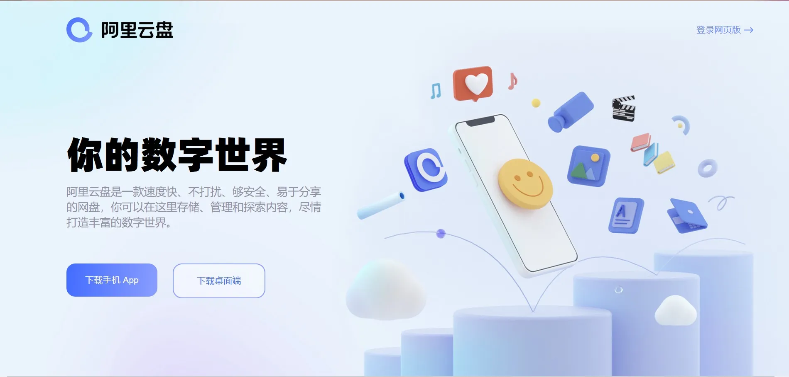
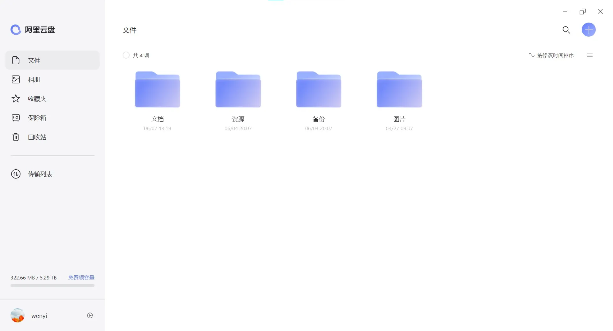
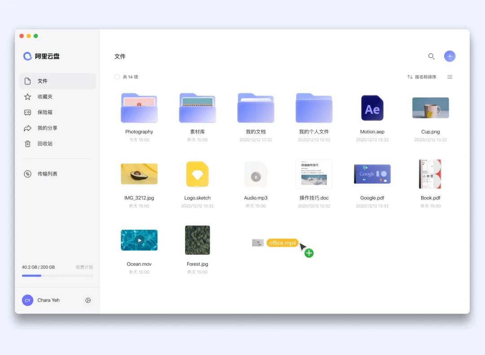
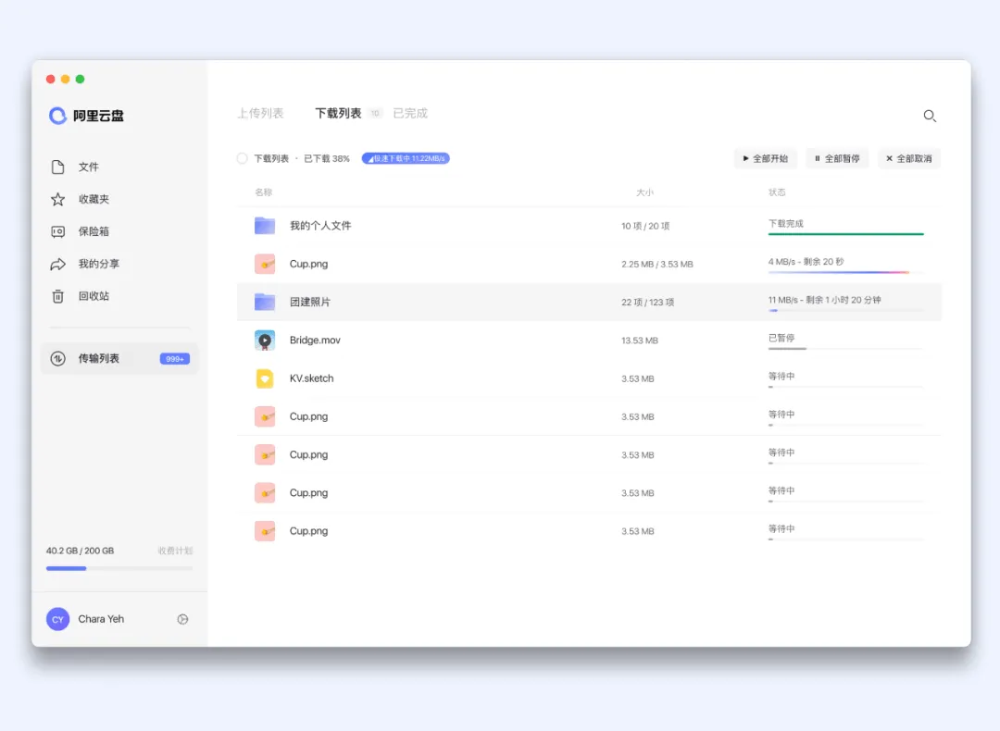
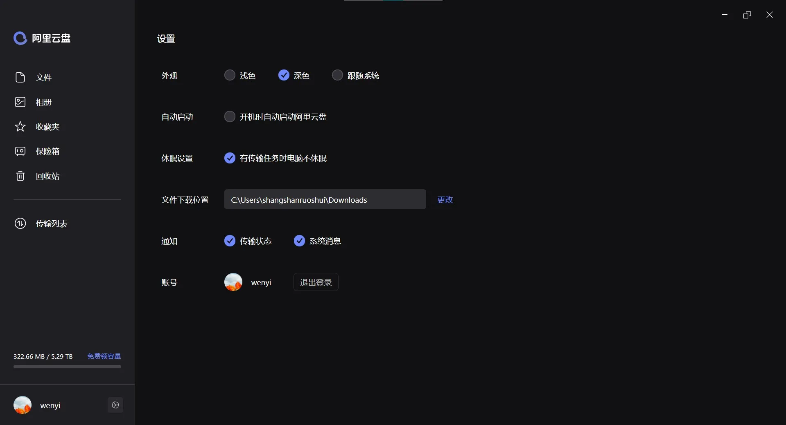

# 阿里云盘桌面端体验

今天发现阿里云盘桌面端上线了。

### 功能

体验之后感觉功能比较简单，和网页版差不多，目前分享功能暂时不能使用。

支持拖拽上传和断点续传

可以在设置中打开深色模式，夜间使用时护眼，还有传输时电脑不休眠，实现不中断传输。

其他功能我还没有体验，抽空再体验一下。

### 福利码

&gt; 兑换福利码：
&gt; 在 App 点击头像 -- 进入福利社 -- 兑换福利码 -- 输入**桌面端上线了**，即可领取 200GB 容量。

---

> 作者:   
> URL: https://blog.wenyi.org/posts/alidrive-for-desktop/  

