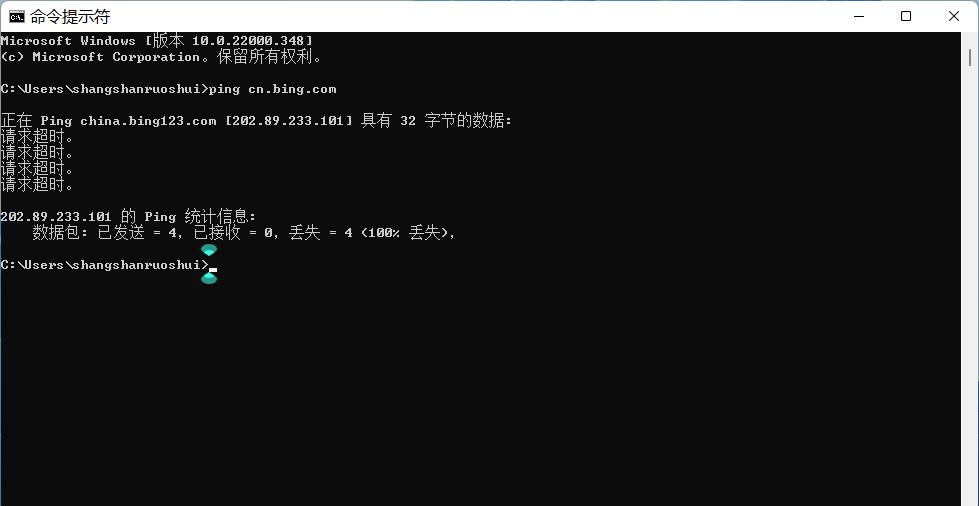
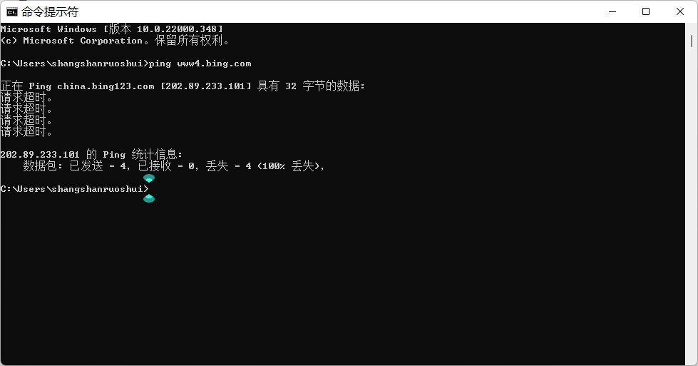
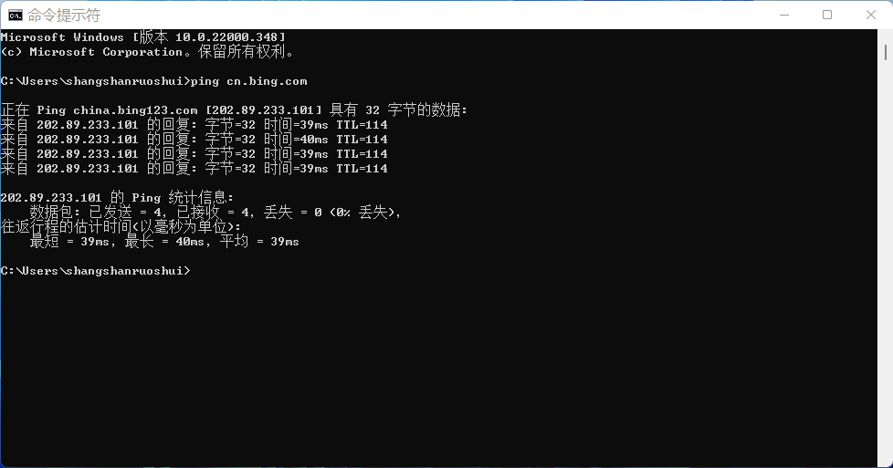

# Bing 无法访问

昨天下午，我搜索资料时，发现 Bing 无法加载。我还以为是自己的网络问题，更换设备后还是打不开，今天看到 `&lt;a rel=&#34;noreferrer noopener&#34; href=&#34;https://www.ithome.com/0/592/920.htm&#34; target=&#34;_blank&#34;&gt;`IT 之家`&lt;/a&gt;`消息后才知道部分地区无法访问。

&gt; 微软 Bing 表示，根据中华人民共和国法律，Bing 中国已经被政府有关部门要求在中国内地暂停“搜索自动建议”功能 30 天。作为全球性搜索平台，Bing 将持续致力于尊重法治与用户获取信息的权利，在遵守法律的前提下最大限度地帮助客户寻找所需信息。

山东移动 Ping 100% 丢失，请求超时。

**临时解决方案：`&lt;a rel=&#34;noreferrer noopener&#34; href=&#34;https://www4.bing.com&#34; target=&#34;_blank&#34;&gt;`https://www4.bing.com`&lt;/a&gt;`**

今天（2021.12.18 7:05）发现临时解决方案失效，山东移动 Ping 100% 丢失，只能用其他方法了。

**现在（2021.12.18 11:21）Bing 可以访问了，恢复正常。**

---

> 作者:   
> URL: https://blog.wenyi.org/posts/bing-is-not-accessible/  

