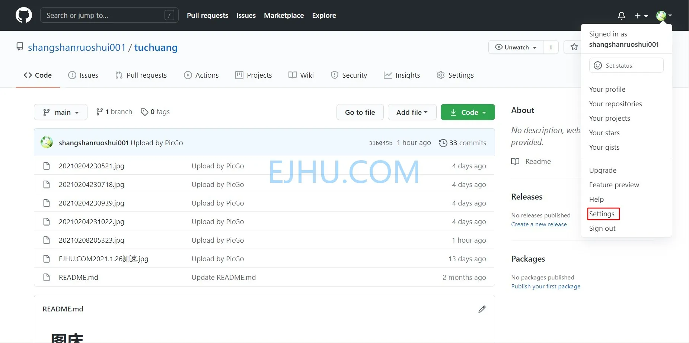

# 修改 Github 用户名

最近想到之前 Github 用户名设置的有点长，不方便输入和分享，于是最近想要修改Github 用户名。下面说一下 Github 用户名修改方法。

### 关于用户名修改

&gt; 引用 Github Docs：
&gt;
&gt; 更改用户名后，您的旧用户名即可供其他人申请使用。 对旧用户名下仓库的大多数引用会自动更改为新用户名。 不过，指向您个人资料的某些链接不会自动重定向。
&gt; 更改用户名后，指向以前的个人资料页面的链接（例如 [https://github.com/previoususername](https://github.com/previoususername)）将返回 404 错误。

### 更改用户名步骤

1. 点击右上角头像，选择 **Settings**；

2. 在左侧边栏中，点击 **Account**；

3. 然后点击 **Change username**；

4. 输入新的用户名，如果新的用户名可用，点击 **Change my username** 即可。

---

> 作者:   
> URL: https://blog.wenyi.org/posts/change-github-username/  

