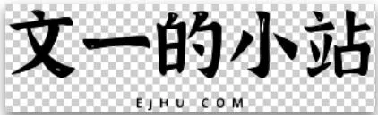

# 更换小站 Logo 和 Favicon

前几天给小站更换 Logo 和 Favicon，以前的 Logo 和 Favicon 是用同一张图片制作的。

旧版 Logo 在首页很小，看不清，而且没有适配夜间模式。新版 Logo 在此基础上只保留文字部分，然后把上半部分删去，又添加了在夜间模式显示的 Logo。

旧版 Favicon 由于直接使用图片，在浏览器标签页上只看到了红色的方框，凸显不出站点的个性。所以新版 Favicon 变得更精简，去除文字部分，这样就能看清楚了。

---

> 作者:   
> URL: https://blog.wenyi.org/posts/change-logo-and-favicon/  

