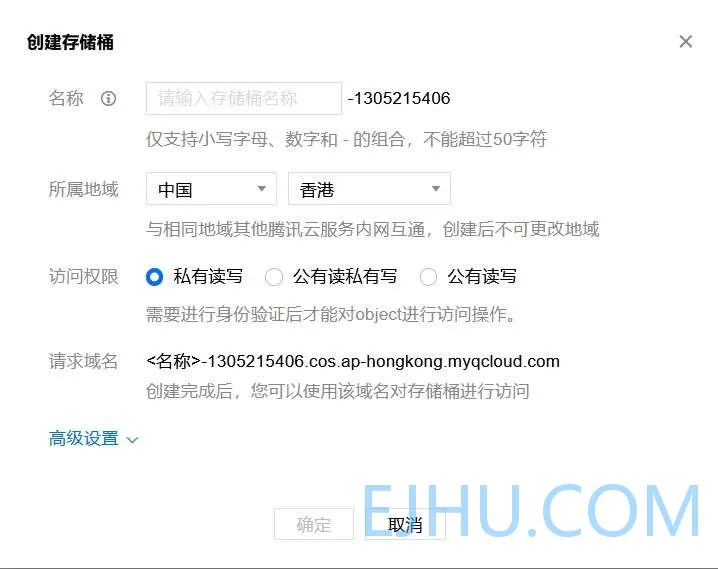
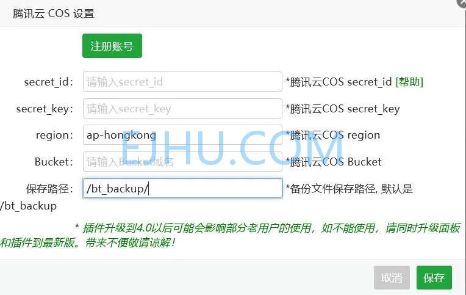
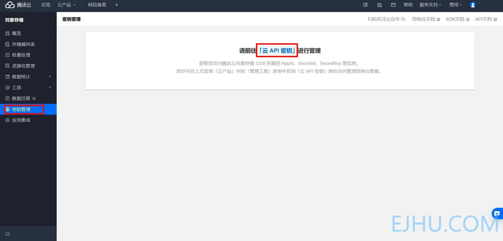
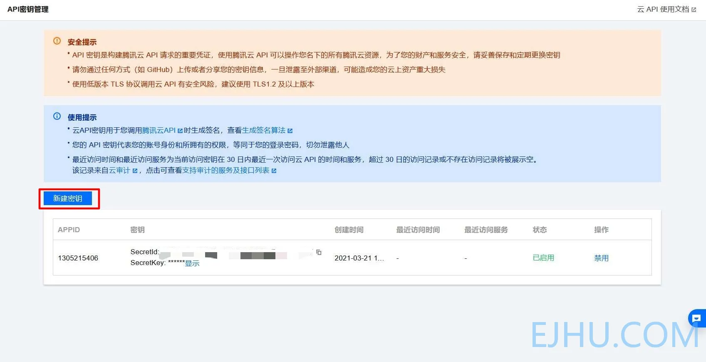
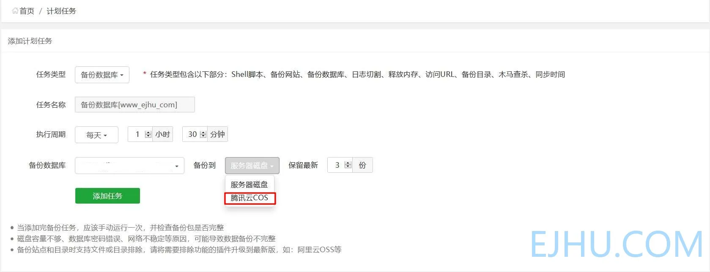

# 使用对象存储备份网站数据

最近我给小站进行安全方面的设置，防止小站被攻破，数据被破坏。以前只是把数据每天备份到服务器本地磁盘，现在觉得不安全，应该在其他地方也要备份。

## 安装插件

在宝塔面板**软件商店——宝塔插件**中选择插件下载，我选的是**腾讯云 COS**，需要在腾讯云开通对象存储（COS）服务才能使用。
腾讯云对象存储 COS：[https://cloud.tencent.com/product/cos](https://cloud.tencent.com/product/cos)

## 开通服务

 开通后，需要 `&lt;strong&gt;`存储桶列表 `&lt;/strong&gt;`中创建存储桶。名称随便，所属地域根据情况选择，访问权限选择私有读写。

如图：

## 插件配置

* secret_id 与 secret_key 填写密钥创建密钥方法：
  
* region 填所属地域
* Bucket 填存储桶名称
* 保存路径自定义

## 计划任务

在添加任务时选择备份到**腾讯云 COS**，数据文件就会备份到存储桶中。

---

> 作者:   
> URL: https://blog.wenyi.org/posts/cos-backup-website/  

