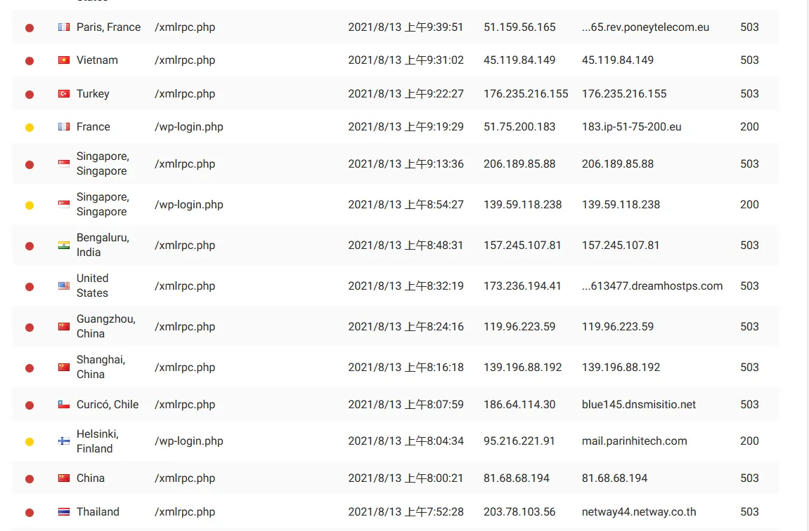
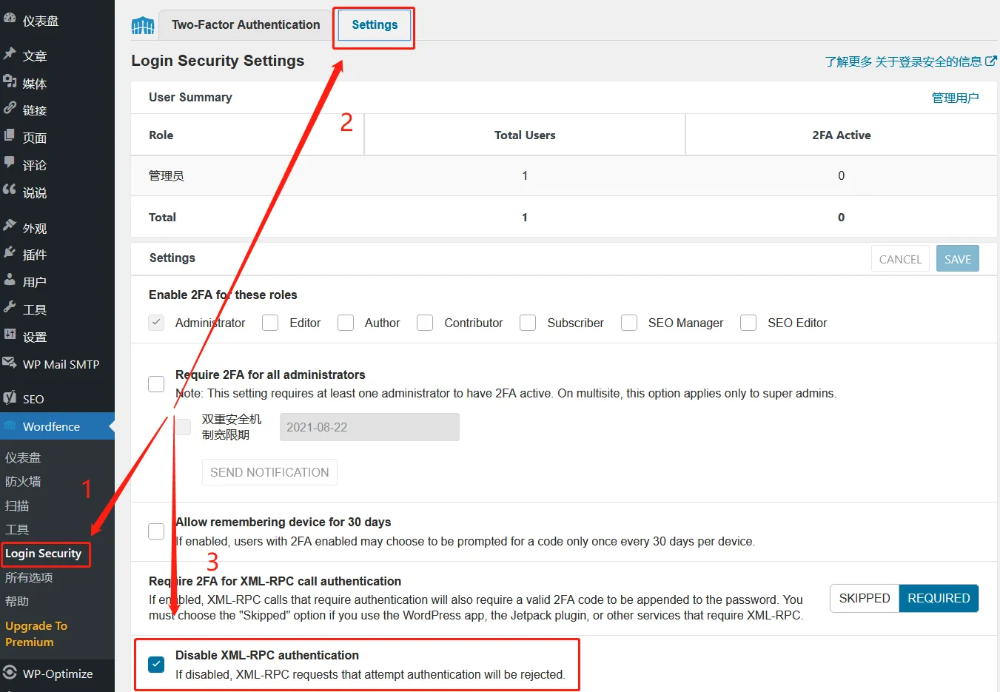

# 禁用 XML-RPC 服务

## 前言

小站迁移到 WordPress 已经有几天时间了。最近查看 Wordfence 拦截日志时发现有人在不断访问 xmlrpc.php，经过查找资料了解到有安全风险，可能会被暴力破解。

## 方法

### 通过插件

不想修改文件，一键禁用 XML-RPC，可以随时开启和禁用。

#### Disable XML-RPC [1]

这个插件使用方法很简单，直接启用就可以了，XML-RPC 在插件启用后被禁用。

#### Wordfence [2]

这个是我目前使用的插件，WordPress 插件库安装量最多的安全插件。它非常强大，提供防火墙、恶意软件扫描、IP 阻止、实时流量监控和登录安全等功能，禁用 XML-RPC 只是众多功能中的一个小功能。

设置步骤：

### 修改文件

#### 修改 .htaccess 文件

    # Block WordPress xmlrpc.php requests`&lt;Files xmlrpc.php&gt;`
	Order Deny,Allow
	Deny from all
	`&lt;/Files&gt;`

[1]: https://cn.wordpress.org/plugins/disable-xml-rpc/
[2]: https://wordpress.org/plugins/wordfence/

---

> 作者:   
> URL: https://blog.wenyi.org/posts/disable-xml-rpc/  

