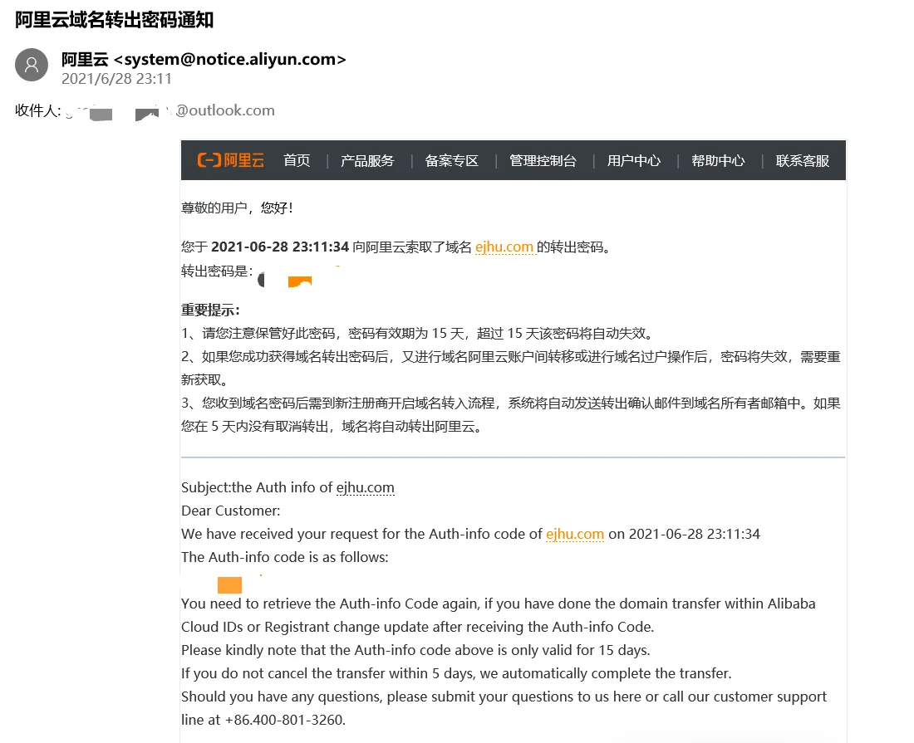
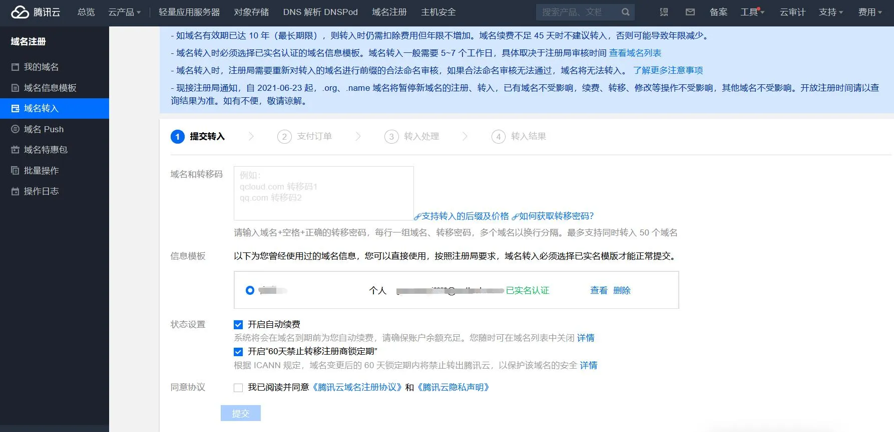
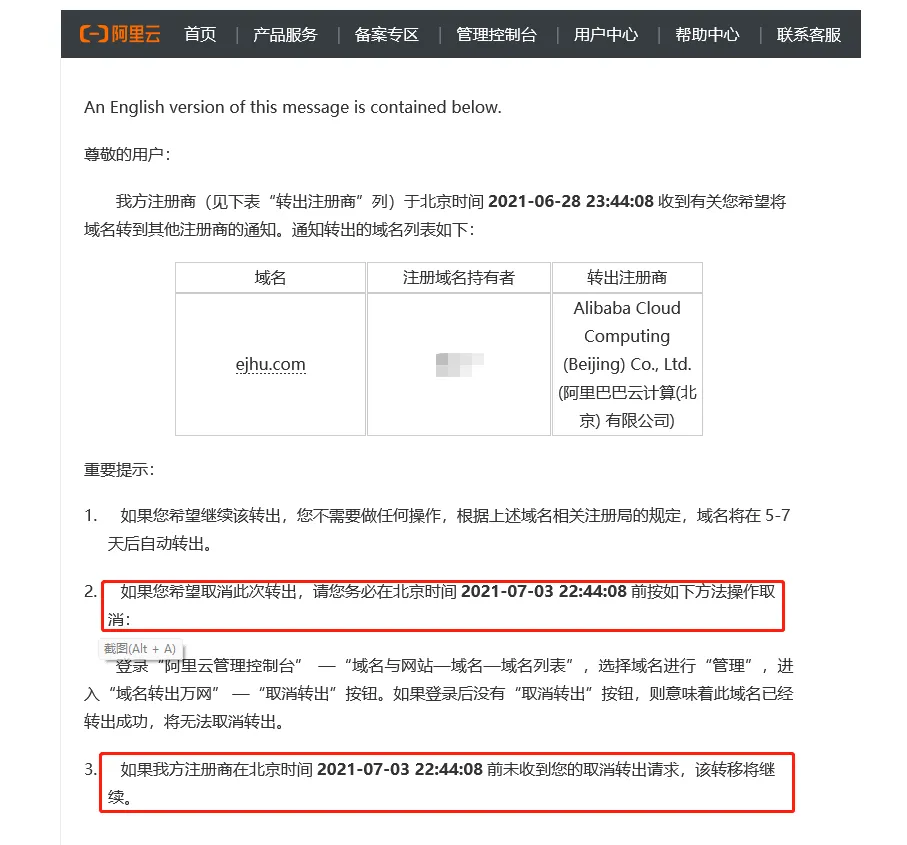
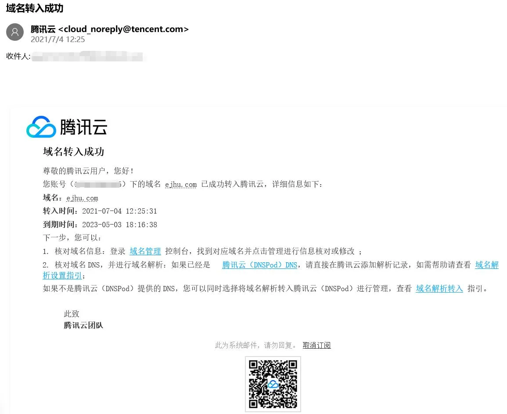

# 域名从阿里云转入到腾讯云

小站的域名以前在阿里云，现在转入到腾讯云了。之前给域名续费时，发现腾讯云域名价格比阿里云便宜一点，转入需要 48 元，而且小站的服务器是腾讯云的，放在一起方便管理。

## 转出阿里云

首先登录阿里云域名控制台：[https://dc.console.aliyun.com](https://dc.console.aliyun.com)。接下来点击需要转出的域名右侧的「管理」，在左侧栏菜单栏找到「域名转出」，获取并填写邮箱验证码，然后域名持有者的邮箱就会收到阿里云发送的域名转出密码。

## 转入腾讯云

打开腾讯云控制台的域名管理：[https://console.cloud.tencent.com/domain/trans-in](https://console.cloud.tencent.com/domain/trans-in)。如果以前创建过信息模板，直接使用就可以了。没有的话，点击「域名信息模板」，按照要求新建一个模板提交审核，一般一个工作日内通过。

在「域名转入」页面，按照提示填写域名和转移码，选择已经实名的信息模板，然后点提交就可以了。

## 等待域名转移

过了一会儿就收到了阿里云发送的转出通知邮件，提示如果希望取消转出，需要在 2021年7月3日22:44:08 前取消转出，到时未取消转出，转移将继续。

## 域名转移成功

收到腾讯云发来的提醒，2021年7月4日12:25:31 域名转入成功，然后就可以在腾讯云管理域名了。

---

> 作者:   
> URL: https://blog.wenyi.org/posts/domain-name-transfer-from-alicloud-to-tencentcloud/  

