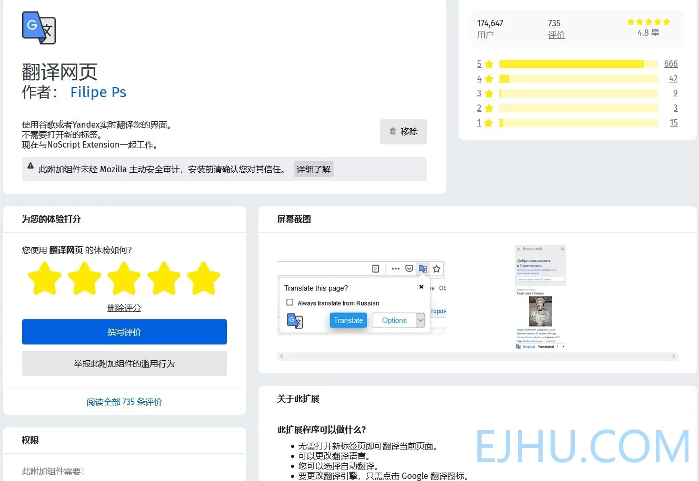

# Firefox 翻译扩展

最近又换回 Firefox 了，现在 Firefox 为主，Edge 为辅。大部分网页能通过 Firefox 打开，只有个别的网站需要 Chromium 内核或 IE 浏览器才能打开时换用 Edge 或 IE。

现在有许多浏览器自带网页翻译功能，例如 Chrome 和 Edge。还有一些国内的浏览器也有这项功能。但是也有一些因为其他原因没有这项功能的浏览器，例如 Firefox 和我之前用过的 Vivaldi。

虽然这项功能平时用不上，但是遇到看不懂的地方就很方便。有内置翻译功能的浏览器可以直接使用，没有也可以安装扩展，安装上以后效果一样。Chromium 内核的浏览器直接从 Chrome 网上应用店挑选下载，我认为很好用的翻译扩展是侧边翻译和沙拉查词，这两个扩展可以划词翻译和整页翻译，非常棒！Firefox 的附加组件商店里也有翻译扩展，但是好多扩展失效了。有的只能划词翻译，无法翻译整个页面，所以在网上搜关于 Firefox 翻译网页的相关问题，有好多人问这方面的问题。我看了一下网友推荐的扩展，目前能在 Firefox 上使用的具有划词翻译和整页翻译的扩展是“**翻译网页**”。链接：[https://addons.mozilla.org/zh-CN/firefox/addon/traduzir-paginas-web/?utm][1]

“**翻译网页**” 可以在 Firefox 附加组件商店上下载，下载完成后简单设置一下就可以使用了，开箱即用。另外侧边翻译火狐版也可以使用，只是稍微麻烦些：侧边翻译在Firefox 附加组件商店里下载安装。

&gt; 但是从商店下载的版本只能使用划词翻译的功能，无法使用页面翻译的功能，具体说明看这里：[https://github.com/EdgeTranslate/EdgeTranslate/blob/master/docs/wiki/zh_CN/%E8%87%B4%E7%81%AB%E7%8B%90%E7%94%A8%E6%88%B7.md&amp;#34;](https://github.com/EdgeTranslate/EdgeTranslate/blob/master/docs/wiki/zh_CN/%E8%87%B4%E7%81%AB%E7%8B%90%E7%94%A8%E6%88%B7.md%22)在商店中下载的版本无法使用翻译网页的功能，可以在扩展 Github 仓库中下载扩展文件后安装。

经过这一番操作，使 Firefox 也拥有翻译功能了。

[1]: https://addons.mozilla.org/zh-CN/firefox/addon/traduzir-paginas-web/?utm_source=addons.mozilla.org&amp;utm_medium=referral&amp;utm_content=search

---

> 作者:   
> URL: https://blog.wenyi.org/posts/firefox-translation-extension/  

