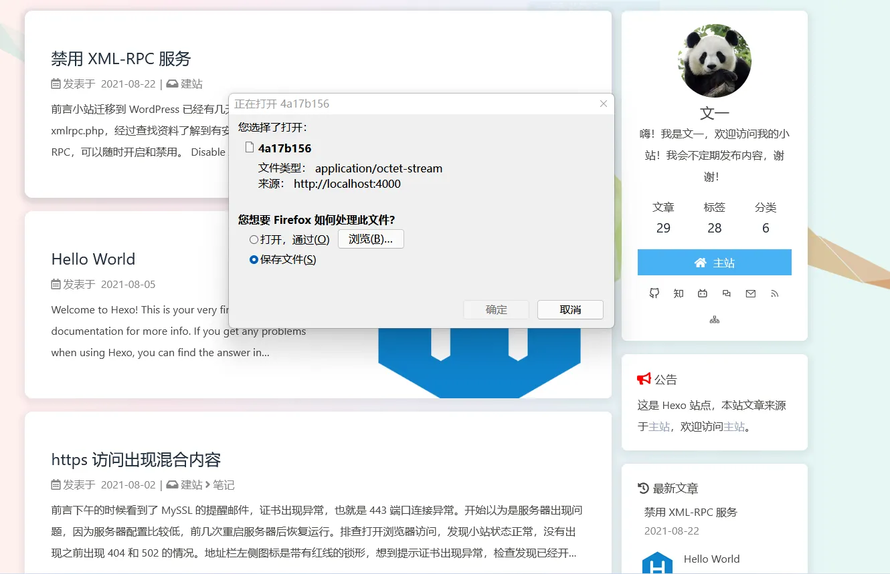

# Hexo 点击文章变成了下载

### 问题

最近我在修改 Hexo 的时候遇到了一个问题，部署到 Github 后访问显示这样：

### 原因

修改 Hexo 配置文件 **config.xml** 中的 **permalink** 少了后面的 / ，添加后保存，然后执行 hexo g 就解决问题了。

    permalink: posts/:abbrlink/

---

> 作者:   
> URL: https://blog.wenyi.org/posts/hexo-redirecting-articles-has-turned-into-downloads/  

