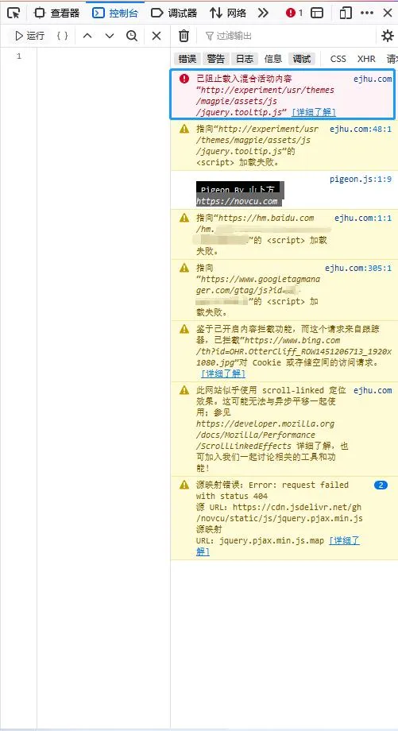
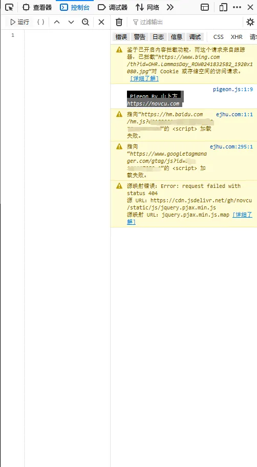

# HTTPS 访问出现混合内容

## 前言

下午的时候看到了 MySSL 的提醒邮件，证书出现异常，也就是 443 端口连接异常。开始以为是服务器出现问题，因为服务器配置比较低，前几次重启服务器后恢复运行。

## 排查

打开浏览器访问，发现小站状态正常，没有出现之前出现 404 和 502 的情况。地址栏左侧图标是带有红线的锁形，想到提示证书出现异常，检查发现已经开启强制 HTTPS，那就不是本身的问题。

调出 Firefox 的控制台发现报错，提示 “**已阻止载入混合活动内容**”，根据路径判断是主题的问题。

按照文件路径在主题文件夹中查找，没有找到这个文件，只能咨询主题作者了。

## 解决

问题的原因是主题缺少文件，在后台用上一个版本的文件替换，恢复正常了。

---

> 作者:   
> URL: https://blog.wenyi.org/posts/https-mixed-content/  

