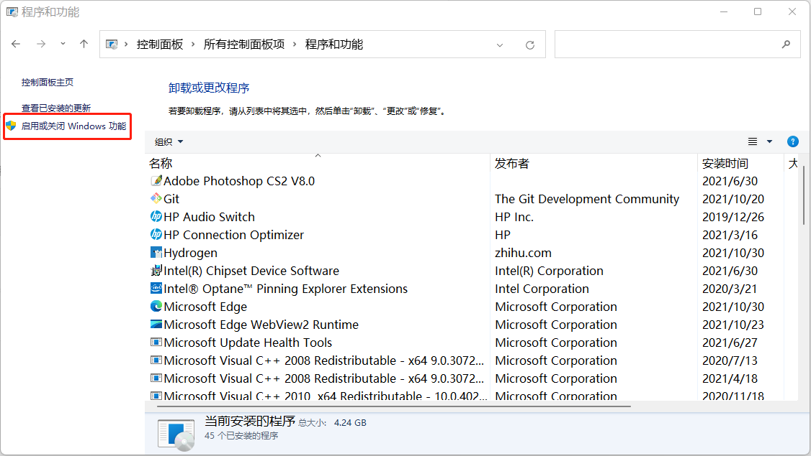
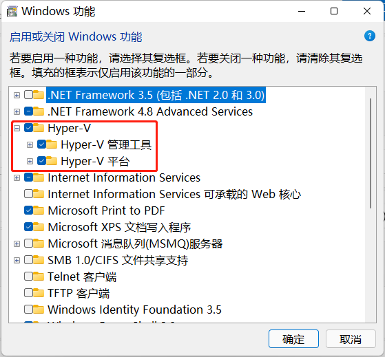
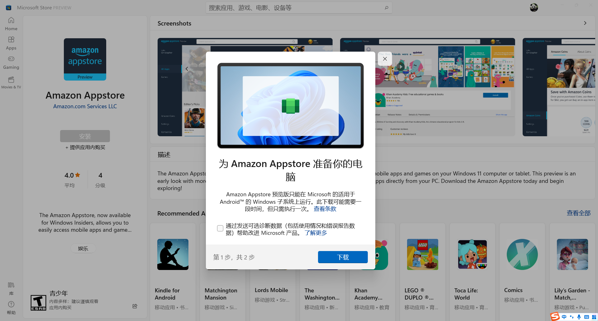
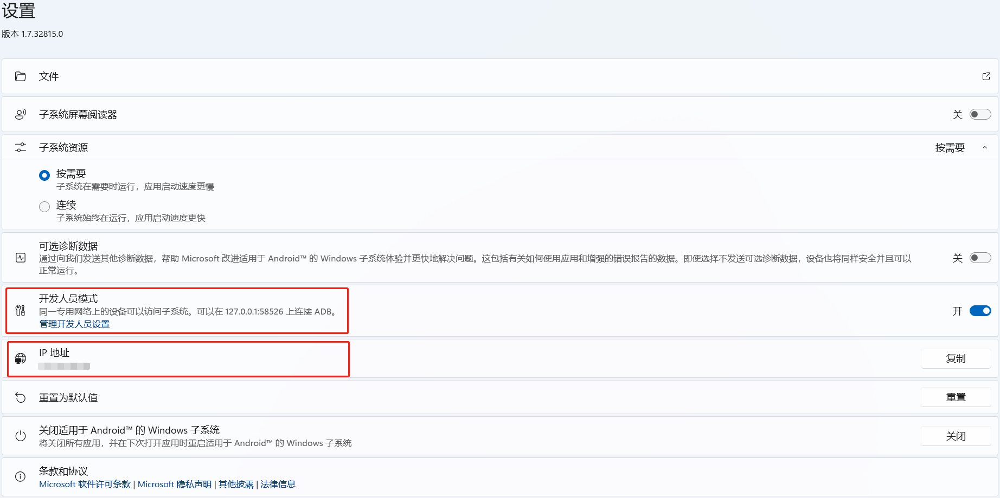
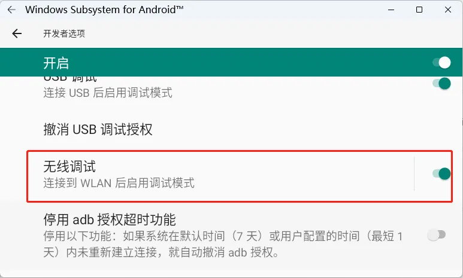
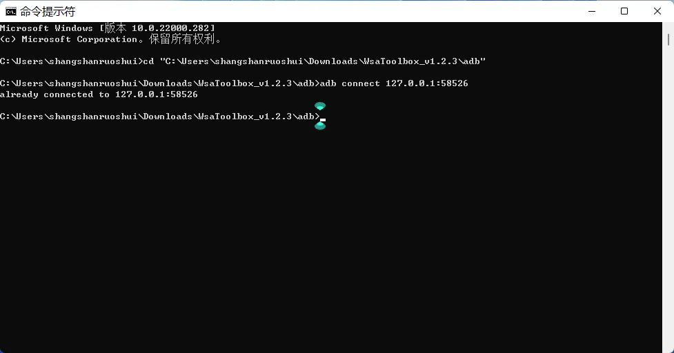
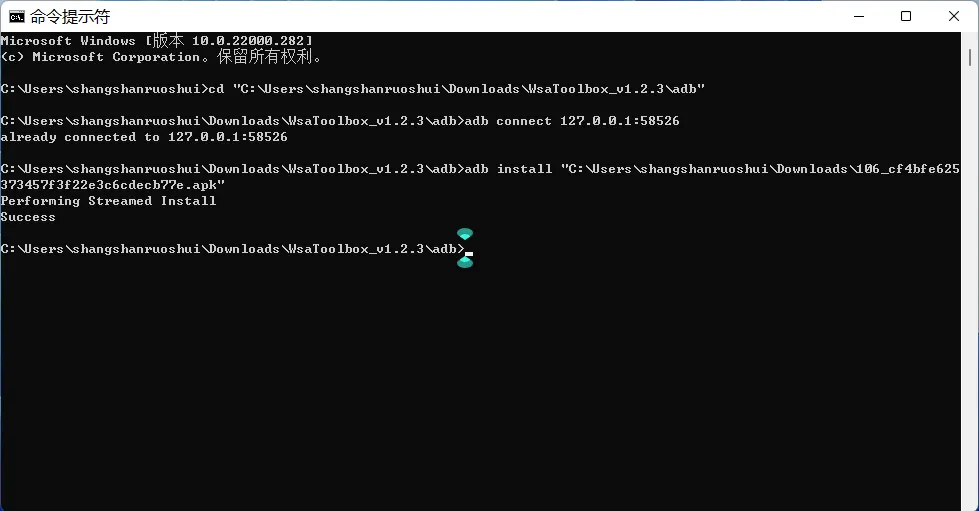
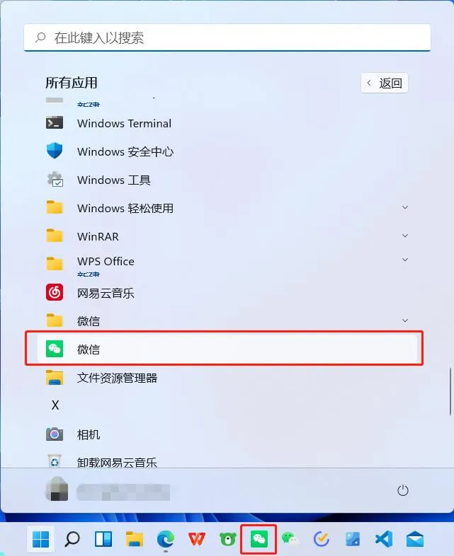
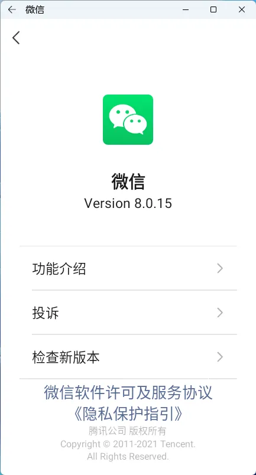

# 安装 Windows 11 安卓子系统

## 准备

&lt;div class=&#34;wp-block-zibllblock-alert alert-dismissible fade in&#34;&gt;
  &lt;div class=&#34;alert jb-yellow&#34; data-isclose=&#34;&#34; role=&#34;alert&#34;&gt;
    注意：&lt;br /&gt;需要已经加入 Windows 预览体验计划，并且在预览体验成员设置选择 &lt;strong&gt;Beta 渠道。&lt;/strong&gt;Windows 企业版、专业版或教育版可以开启 Hyper-V，Windows 家庭版没有此项功能。
  &lt;/div&gt;
&lt;/div&gt;

1.在**设置——时间和语言——语言 &amp; 区域——区域**，把「**国家或地区**」改为美国。

2.确认 **Hyper-V** 是否开启，方法：

首先打开**控制面板**——**程序和功能**，然后点击「启用或关闭 Windows 功能」；

接下来在弹出的 Windows 功能选择框中勾选 **Hyper-V**。

## 安装

打开 Microsoft Store，搜索下载 Amazon AppStore，或点击链接转跳：[http://aka.ms/AmazonAppstore](http://aka.ms/AmazonAppstore)。点击安装后会提示下载 Windows Subsystem for Android，如图：

安装包比较大，需要等待一会儿。

## 使用

### 设置

安装完成后，打开 Windows Subsystem for Android，开启开发者模式。

然后点击「**管理开发人员设置**」，打开 Android 开发者选项页面开启「**无线调试**」，点击 IP 地址刷新获取 IP 地址。

### 安装应用

由于已安装的 Amazon AppStore 需要美区帐号，而且可安装的应用较少，所以需要通过 adb 旁加载安装应用。

安装 adb，下载链接：[https://dl.google.com/android/repository/platform-tools-latest-windows.zip](https://dl.google.com/android/repository/platform-tools-latest-windows.zip)，下载后解压。打开 **Windows PowerShell** 或**命令提示符**，然后 CD 到 adb 所在的文件夹（已解压），输入：

    adb connect 127.0.0.1:58526

连接成功如下图所示：

连接成功以后，接下来从应用商店下载 APK，我下载的是微信。首先 CD 到 APK 文件所在的文件夹，然后使用 adb install 命令安装应用，例如：

    adb install 106_cf4bfe625373457f3f22e3c6cdecb77e.apk

安装完成后，应用在开始应用列表显示，也可以固定到任务栏。

### 使用应用

运行比较稳定，没有出现闪退现象，应用截图：

---

> 作者:   
> URL: https://blog.wenyi.org/posts/installing-the-windows11-android-subsystem/  

