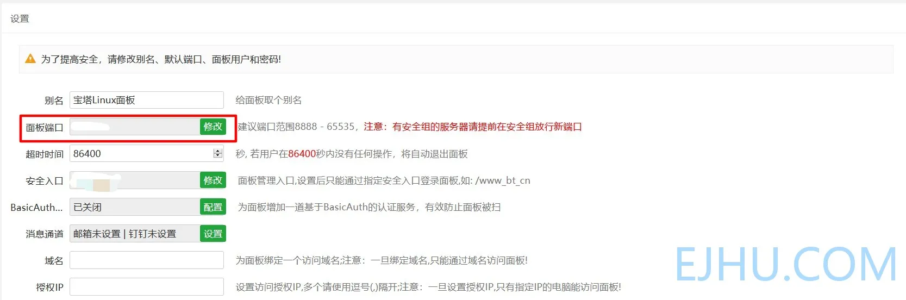
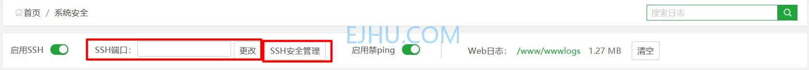
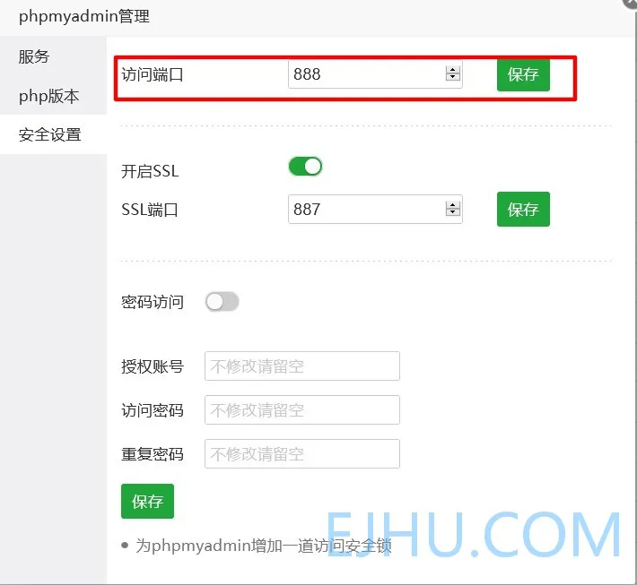
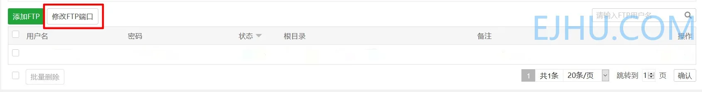

# 修改默认端口

之前发现总有一些陌生的 IP 尝试连接主要端口，怀疑是暴力破解攻击，尤其是 22 端口。使用默认端口不安全，容易被攻破，需要修改默认端口。

## 修改宝塔面板端口

默认通过 8888 端口访问宝塔面板。在**面板设置**中修改端口范围 8888-65535，提前在服务器控制台放行新端口。

放行端口 &lt;https://www.bt.cn/bbs/thread-40037-1-1.html&gt;
 

## 修改 SSH 端口

SSH 默认端口是 22 端口，经常被暴力攻击，很不安全。在**安全**中修改 SSH 端口（注意：修改完成后记得在 SSH 连接工具修改连接端口），根据 SSH 安全管理中的风险提醒修改其他相关配置。

## 修改 phpmyadmin

phpmyadmin 默认端口是 888 端口，在面板**软件商店**中找到 phpmyadmin，然后点击右边的**设置**，然后选择**安全设置**。

## 修改 FTP 端口

21 端口是 FTP 的默认端口，如果不使用 FTP 就不用开启也不用修改。修改方法：

## 总结

需要使用的服务建议修改默认端口，不使用的端口不要开启。

---

> 作者:   
> URL: https://blog.wenyi.org/posts/modify-the-default-port/  

