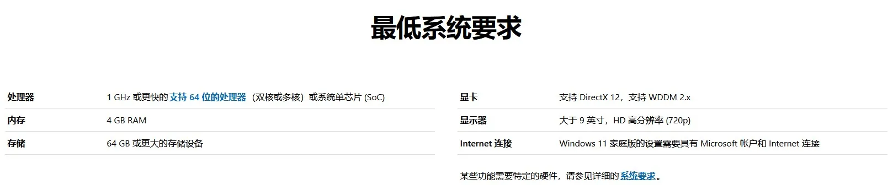
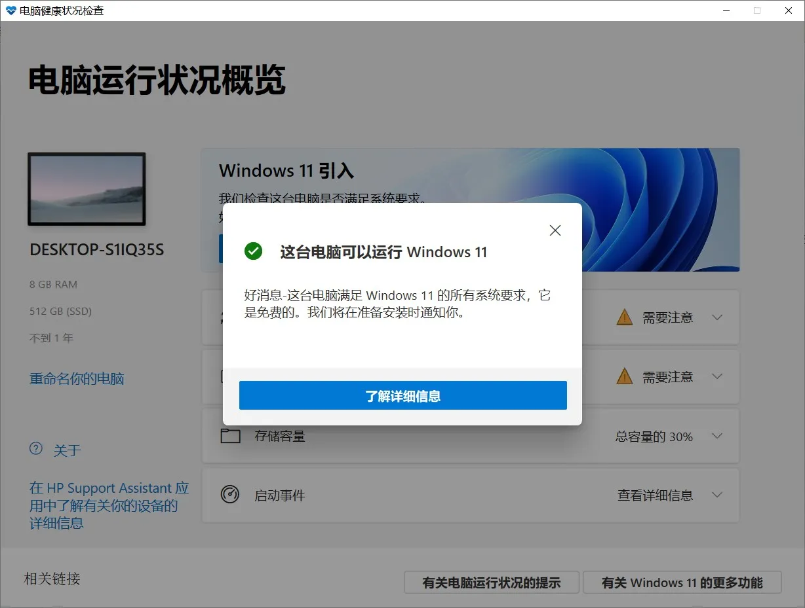
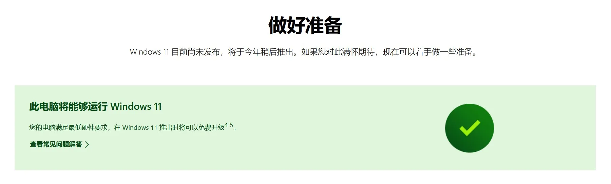

# 检查电脑能否升级到 Windows 11

今天看到网上消息说 Windows 11 就要来了，很期待我的电脑能升级到新系统。

官网介绍：
[https://www.microsoft.com/zh-cn/windows/windows-11](https://www.microsoft.com/zh-cn/windows/windows-11)

官网上有**最低系统要求**，可以查看自己的电脑是否符合配置要求。

除此之外微软发布了名为 **PC Health Check** 的工具可以用来检查你的 PC 是否可以运行 Windows 11，下载地址： [https://aka.ms/GetPCHealthCheckApp](https://aka.ms/GetPCHealthCheckApp)

---

我的电脑可以运行 Windows 11，不过现在还不可以升级，需要等到发布后才可以升级。

&gt; 如果出现 `&lt;strong&gt;`满足最低系统要求 `&lt;/strong&gt;`，但检查工具仍然提示「这台电脑无法运行 Windows 11」的问题

&gt; 问题原因：电脑可能没有默认开启 **TPM2.0**
&gt; 解决办法：进入 BIOS 查看 **TPM2.0** 是否开启，不同品牌电脑进入 BIOS 方式不一样，具体方法自行搜索

---

> 作者:   
> URL: https://blog.wenyi.org/posts/preparing-for-the-upgrade-to-windows11/  

