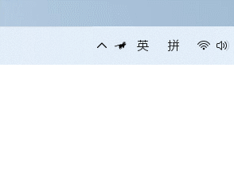
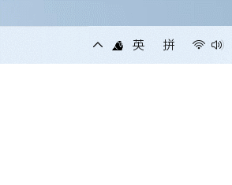
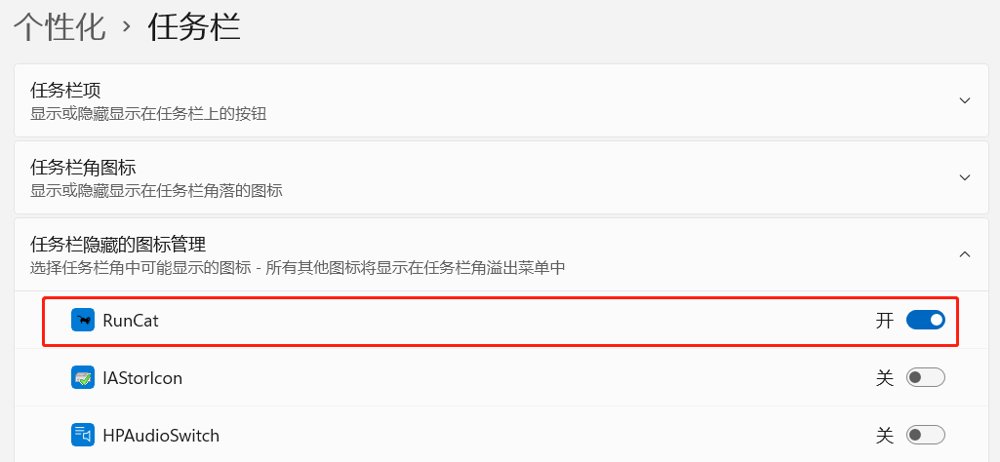

# 让任务栏有趣起来的程序：RunCat

## 介绍

最近在 Github 上发现一个有趣的程序，名字叫做 **RunCat**。安装后会在任务栏显示一只奔跑的小猫，通过小猫奔跑的速度来判断 CPU 使用率，小猫奔跑的速度越快，CPU 使用率就越高。

还可以换成一只摇头的鹦鹉，CPU 使用率越高，鹦鹉摇头的速度越快。

## **安装**

Github 项目：`&lt;a rel=&#34;noreferrer noopener&#34; href=&#34;https://github.com/Kyome22/RunCat_for_windows&#34; data-type=&#34;URL&#34; data-id=&#34;https://github.com/Kyome22/RunCat_for_windows&#34; target=&#34;_blank&#34;&gt;`https://github.com/Kyome22/RunCat_for_windows`&lt;/a&gt;`

&lt;div class=&#34;wp-block-zibllblock-alert alert-dismissible fade in&#34;&gt;
  &lt;div class=&#34;alert jb-yellow&#34; data-isclose=&#34;&#34; role=&#34;alert&#34;&gt;
    需要安装 .NET CORE 才能运行，已经安装 .NET CORE 选择 &lt;a href=&#34;https://github.com/Kyome22/RunCat_for_windows/releases/download/1.10/RunCat_x64.zip&#34;&gt;RunCat_x64.zip&lt;/a&gt;，没有安装 .NET CORE 选择  &lt;a href=&#34;https://github.com/Kyome22/RunCat_for_windows/releases/download/1.10/RunCat_with_.NET5.0.zip&#34;&gt;RunCat_with_.NET5.0.zip&lt;/a&gt;。
  &lt;/div&gt;
&lt;/div&gt;

## 使用

下载完成后解压，双击运行 RunCat.exe，任务栏就会出现一只奔跑的小猫了。

如果使用的是 Windows 11 系统，可能不会在任务栏显示，需要在**设置——个性化——任务栏——任务栏隐藏的图标管理**中开启 RunCat。

---

> 作者:   
> URL: https://blog.wenyi.org/posts/runcat/  

