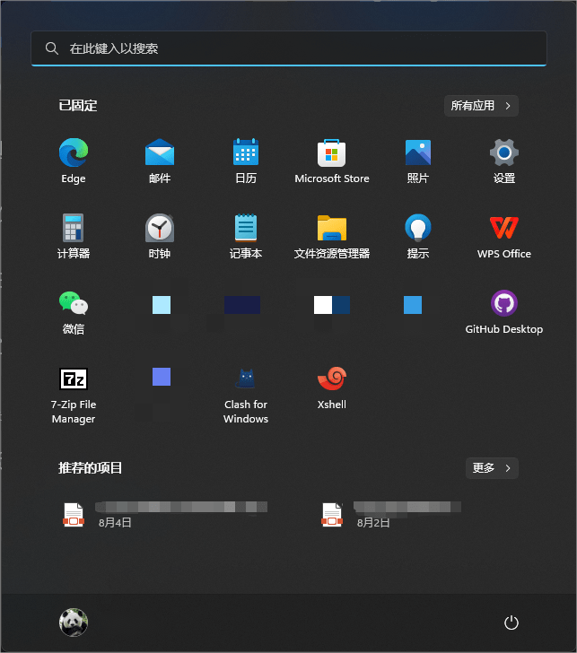
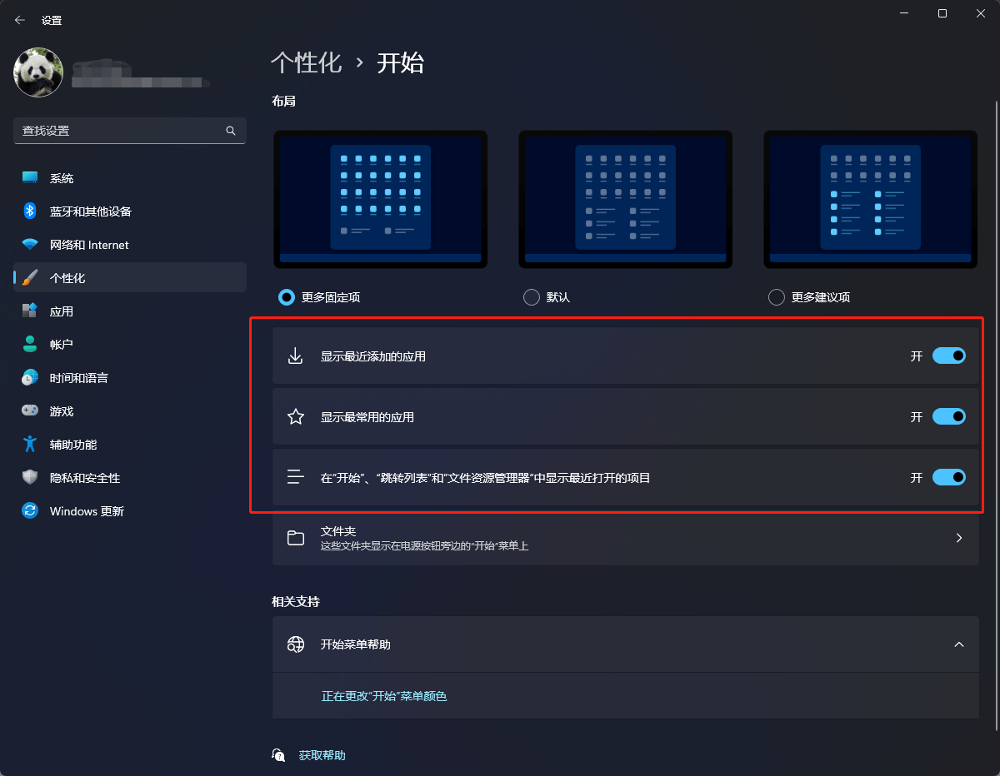

# 关闭 Windows 11 推荐的项目

### 前言

从 Windows 10 升级到 Windows 11 以后，开始菜单变化很大，尤其是增加了「**推荐的项目**」。会显示最近打开的应用和文件，看着有点混乱，所以想要把它关闭。

### 步骤

打开**设置**——**个性化**——**开始**，然后把红框中的三个选项关闭即可。
  

关闭之后「**已固定**」下面会有一块空白区域，可以在「**布局**」中选择「**更多固定项**」，这样可以固定更多的应用。

---

> 作者:   
> URL: https://blog.wenyi.org/posts/turn-off-recommended-items-in-windows11/  

