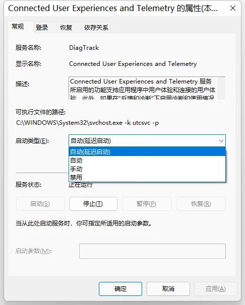

# 无法开启 Windows 发送可选数据诊断

## 问题

加入 Windows 预览体验计划需要开启发送数据诊断，然而有时候发送可选数据诊断无法开启，导致无法加入 Windows 预览体验计划。

## 解决

组合键 `Win&#43;R`，输入 **services.msc**，打开服务找到 _**Connected User Experiences and Telemetry**_，启动类型选择 **启动（延迟启动）**，然后点击启动。

---

> 作者:   
> URL: https://blog.wenyi.org/posts/unable-to-turn-on-windows-send-optional-data-diagnostics/  

