# 升级到 Windows 11

今天发现有些网友已经升级到 Windows 11 了，看起来很好看，我也要尝尝鲜。

&gt; **警告：** 当前属于测试版本，将会存在一些不足之处和低稳定性。升级前需要备份数据，以防数据丢失。

## 升级过程

### 加入 Windows 预览体验计划

**注册 Windows lnsider**：

https://insider.windows.com/zh-cn/

### 安装

1.打开**设置**——**更新和安全**——**Windows 预览体验计划**，然后点击「开始」。

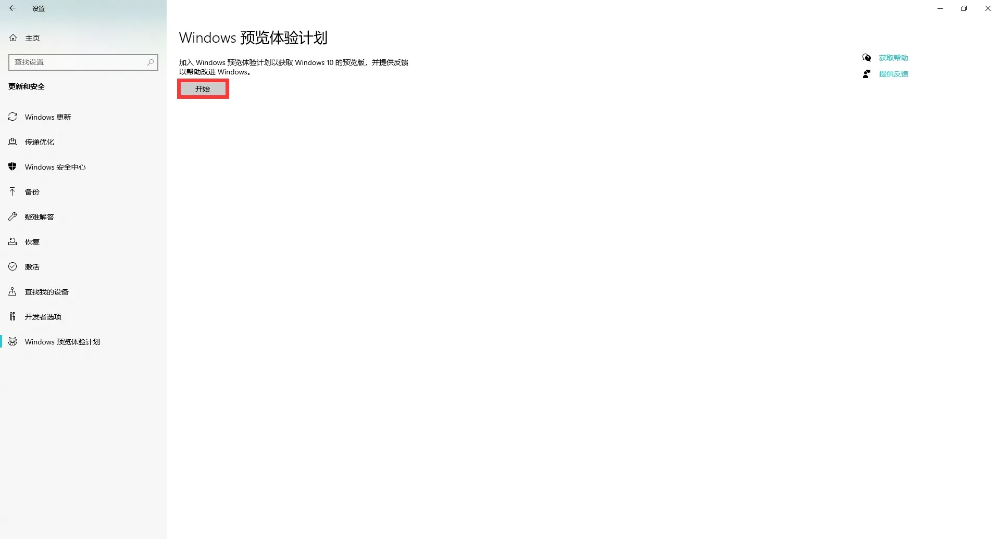

2.点击「链接帐户」，登录微软帐户后点击「继续」，然后选择 **Dev 渠道**。**（2021.7.30 Windows 11 预览体验版本推送至 Beta 渠道，可以选择 Beta 渠道）**。

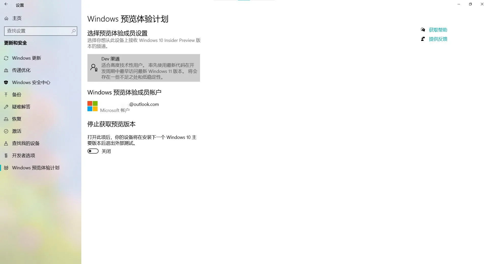

3.选择「立即重启」，等待重启。

4.打开**设置**——**更新和安全**——**Windows 更新**，点击「检查更新」，然后耐心等待Windows 11 预览版的下载和安装。

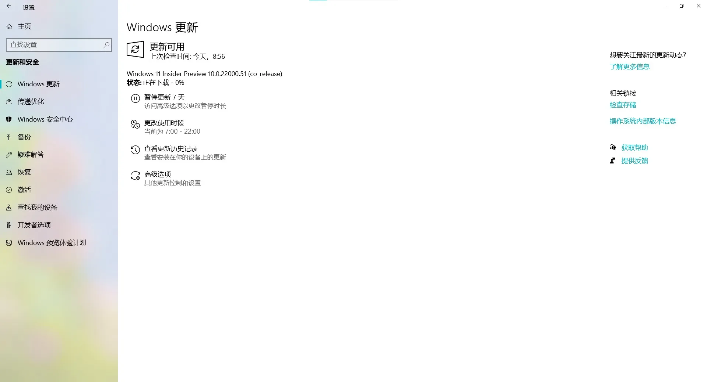

### 成功

如果一切顺利，电脑重启后就成功升级到 Windows 11 了。

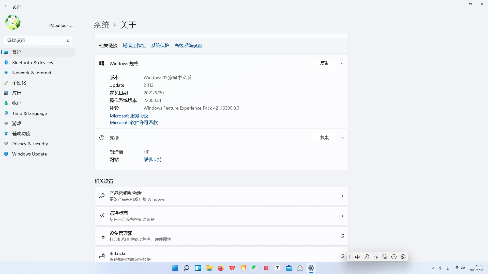

## 升级问题

下面所列的问题是我遇到的问题，仅供参考。

### 问题一

**问题：**

打开 Windows 预览体验计划可能会出现空白页面的情况，如下图：

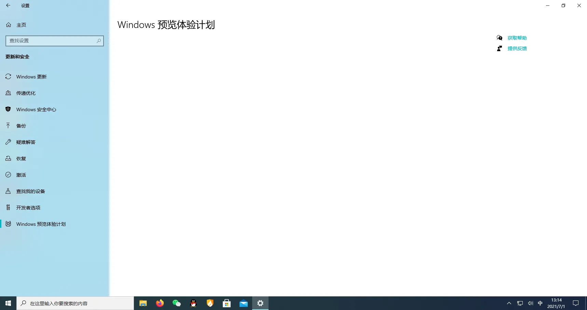

**解决：**

在**设置**——**隐私**——**诊断和反馈**——**诊断数据**中选择「可选诊断数据」。

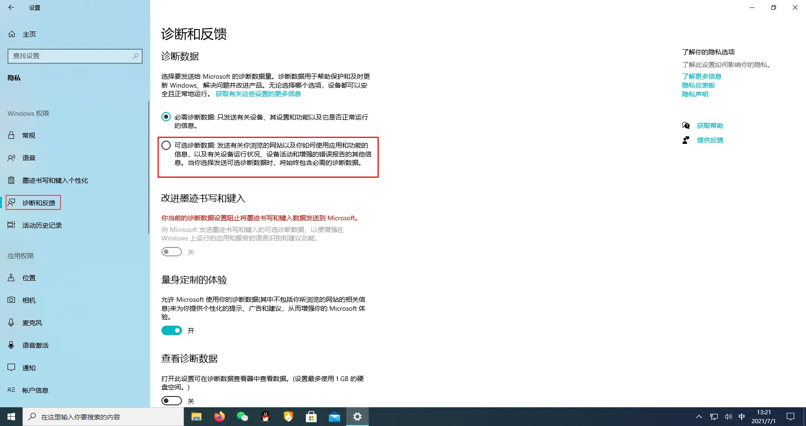

### 问题二

**问题：**

在安装 Windows 11 的过程中可能弹出“你需要关注的事项”的提示，如图：

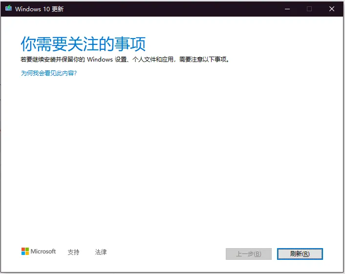

**解决：**

&lt;div class=&#34;wp-block-zibllblock-alert alert-dismissible fade in&#34;&gt;
  &lt;div class=&#34;alert jb-red&#34; data-isclose=&#34;&#34; role=&#34;alert&#34;&gt;
    摘自官网的内容：&lt;br /&gt;在尝试更新到最新版本的 Windows 10 时可能会看到“你需要关注的事项”消息，并且你的电脑会通知驱动程序、硬件、应用、功能或隐私设置的兼容性问题。 这些问题可能会导致意外的体验，因此不会在此时提供更新。&lt;br /&gt;系统主观已经确认了您当前会有兼容性问题，所以主动停止了更新，建议您当前继续使用目前的系统。&lt;a href=&#34;https://support.microsoft.com/zh-cn/windows/-%E4%BD%A0%E9%9C%80%E8%A6%81%E5%85%B3%E6%B3%A8%E7%9A%84%E4%BA%8B%E9%A1%B9-windows-10-%E8%AE%BE%E7%BD%AE%E9%80%9A%E7%9F%A5-0cedddaf-0198-8fe8-3b75-5f83dc7a4c77&#34;&gt;[1]&lt;/a&gt;
  &lt;/div&gt;
&lt;/div&gt;

出现这个问题的原因：可能是电脑安装 **Virtualbox** 虚拟机软件或者**安卓模拟器**软件，卸载后有残留文件。

如果以前安装过雷电模拟器，卸载后还有残留文件，删除 `C:\Program Files\dnplayerext2` 和 `C:\Program Files\ldplayerbox`，或者在「此电脑」中搜索“Virtualbox”，搜索完成后将搜索结果中的“Virtualbox.exe”删除。

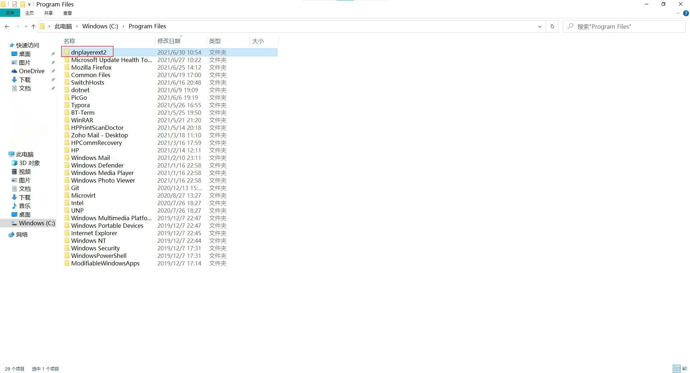

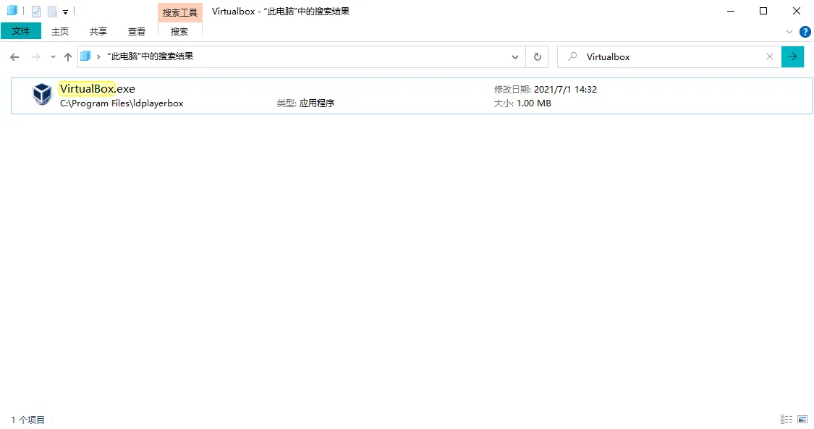

### 问题三

**问题：**

升级完成后，开机电脑屏幕只显示鼠标指针。

**解决：**

**方法一**（我的电脑解决该问题的方法）

组合键 `Ctrl&#43;Alt&#43;Del`，选择「注销」，然后就可以进入系统桌面了。

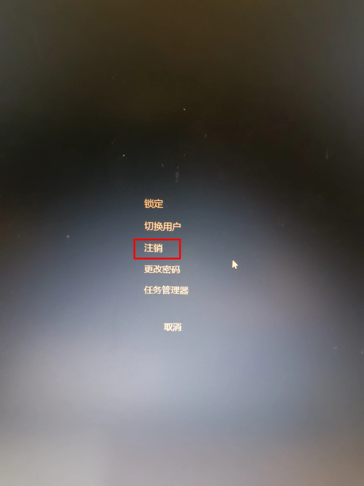

**方法二**（网上解决相关问题回答较多的方法）

组合键 `Ctrl&#43;Alt&#43;Del`，点击进入**任务管理器**——**文件**——**运行新任务**，输入explorer 后按 `Enter`键桌面就出现了。

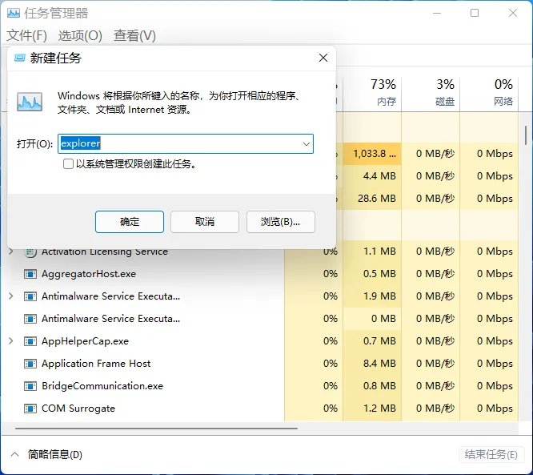

## 参考

&lt;div&gt;
  &lt;div&gt;
    [1] 你需要关注的事项”Windows 10 设置通知 &lt;a class=&#34;external&#34; href=&#34;https://support.microsoft.com/zh-cn/windows/-%E4%BD%A0%E9%9C%80%E8%A6%81%E5%85%B3%E6%B3%A8%E7%9A%84%E4%BA%8B%E9%A1%B9-windows-10-%E8%AE%BE%E7%BD%AE%E9%80%9A%E7%9F%A5-0cedddaf-0198-8fe8-3b75-5f83dc7a4c77&#34; target=&#34;_blank&#34; rel=&#34;noopener noreferrer&#34; data-za-detail-view-id=&#34;1043&#34;&gt;https://support.microsoft.com/zh-cn/windows/-%E4%BD%A0%E9%9C%80%E8%A6%81%E5%85%B3%E6%B3%A8%E7%9A%84%E4%BA%8B%E9%A1%B9-windows-10-%E8%AE%BE%E7%BD%AE%E9%80%9A%E7%9F%A5-0cedddaf-0198-8fe8-3b75-5f83dc7a4c77&lt;/a&gt;
  &lt;/div&gt;
&lt;/div&gt;

---

> 作者:   
> URL: https://blog.wenyi.org/posts/upgrade-to-windows11/  

