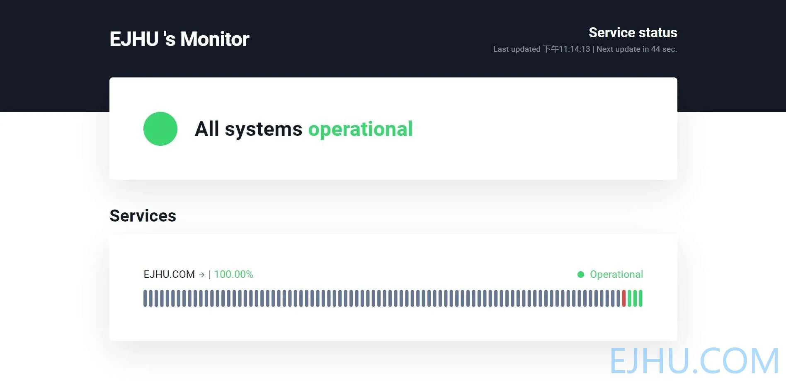
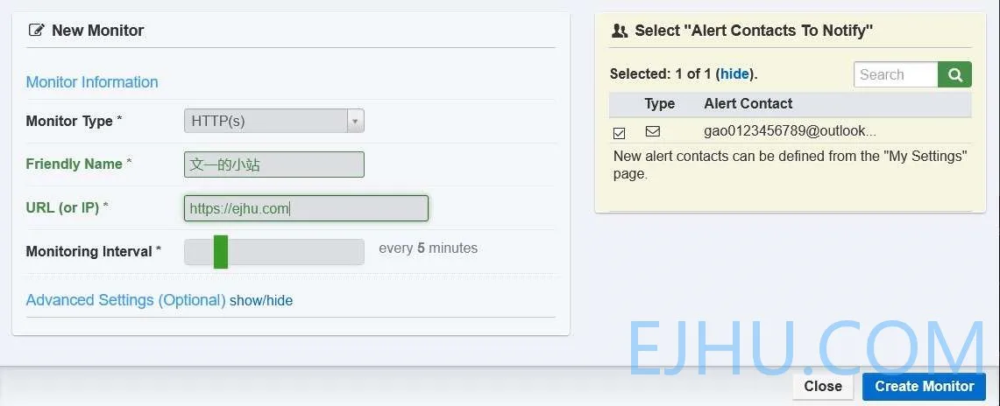
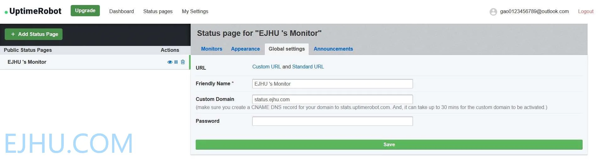

# Uptime Robot 免费的网站状态监控工具

前天我给小站添加了用 **Uptime Robot** 创建的网站状态页面。

本站状态页：[https://stats.uptimerobot.com/n6oMYHGBK6](https://stats.uptimerobot.com/n6oMYHGBK6)

Uptime Robot 免费版 50 个监控配额，可以创建一个状态页面，监视器**支持HTTP(s)、关键词、Ping、端口**等，监视器 **5 分钟触发一次**，警告可以通过邮件等多种方式通知。

Uptime Robot官网：[https://uptimerobot.com](https://uptimerobot.com)

打开页面后点击右上角的 [**Register for FREE**]，填写上用户名、邮箱和密码就可以注册了。然后点击左上角的 [**Add New Monitor**] 创建新的监控项目，可以添加HTTP(s)、关键词、Ping、端口，根据需求自选。右边 ⌈**Select &#34;Alert Contacts To Notify&#34;;⌋** 是消息通知的联系人。

添加完监视器之后，可以点击 [**Status Pages**] 创建站点状态页，免费版支持创建一个状态页。可以设置页面的布局、配色、域名等。

**[更新](https://www.wenyi.org/posts/13/)：现在免费版不支持自定义域名，需要升级到 PRO 版本！**

---

> 作者:   
> URL: https://blog.wenyi.org/posts/uptime-robot/  

