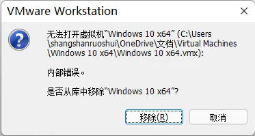
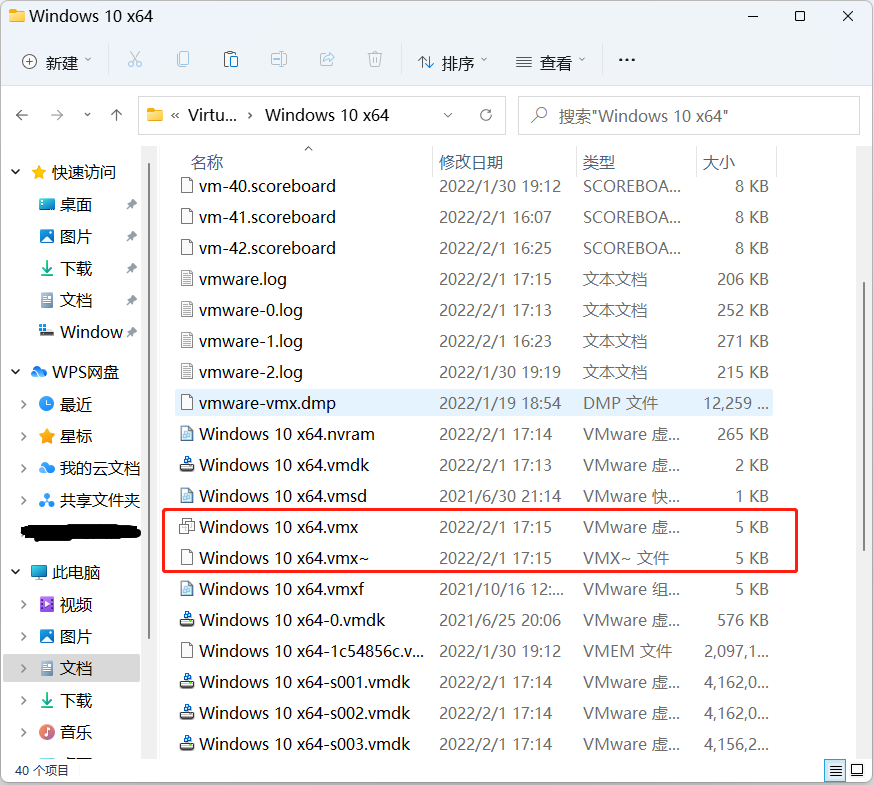

# 解决 VMware 虚拟机运行时 “内部错误” 问题

## 起因

最近在使用 VMware 虚拟机的时候，遇到了一个问题。问题出现在虚拟系统重新启动后，提示“内部错误”。

搜索引擎搜出来的解决方法大部分不能解决这个问题，但有一篇文章给出的方法能解决这个问题，所以我记录下来以备以后查阅。

## 方法

打开虚拟机所在的文件夹，发现有两个虚拟机配置文件，其中一个比另一个多了 ~，然后把多出 ~ 的文件删除。

虚拟机可以正常启动了。

---

> 作者:   
> URL: https://blog.wenyi.org/posts/vmware-internal-errors/  

