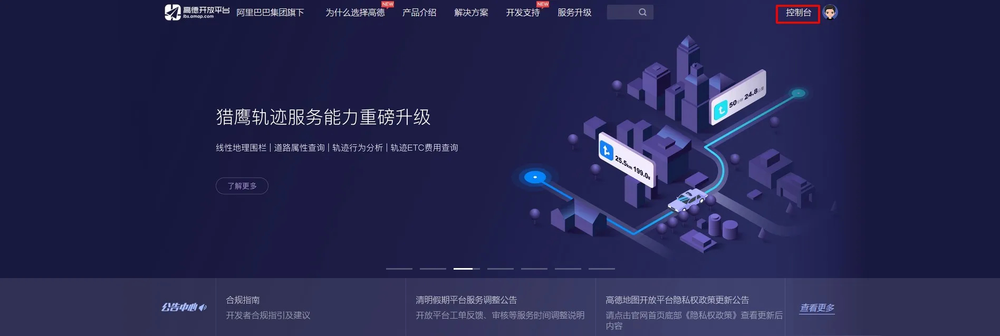
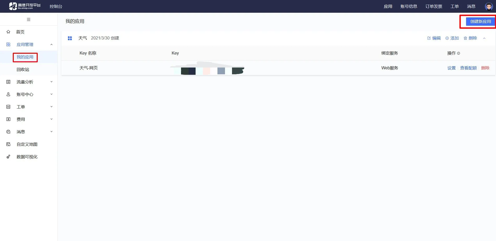
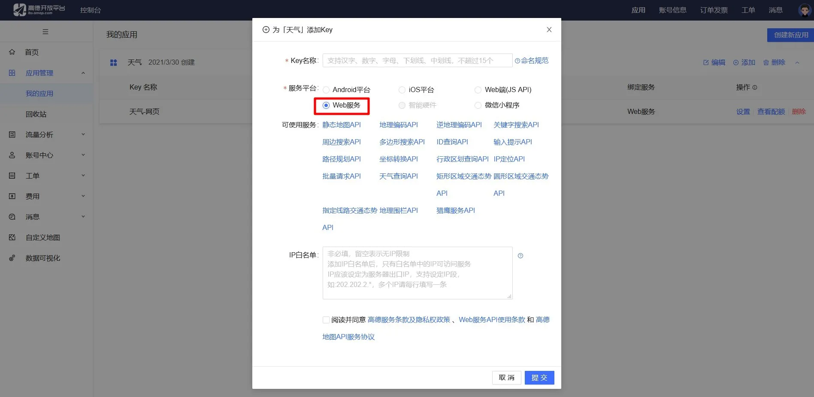

# 天气信息 API 错误

## 起因

前几天发现小站左边栏的天气信息错误，开始以为插件出问题了，后来看了其他使用这个插件的网站没有问题。既然不是插件的原因，那就看看是不是 API 的问题。

## 研究

看了看插件作者的介绍文章后发现是因为使用作者提供的 API，出错的原因是 API 到达调用上限。那就好办了，直接自己申请一个 API 就可以了。

## 解决

### 申请 API

1. 首先访问[高德开放平台](https://lbs.amap.com/)，然后打开**控制台** ;

2. 先点**我的应用**，再点右上角**创建新应用**，应用类型选**天气**；

3. 服务平台选 **Web 服务**，IP 白名单根据情况（如果不想让别人使用 API 需要填写）；

### 使用 API

在插件天气信息中把默认的 API 修改成自己申请的就可以了。

---

> 作者:   
> URL: https://blog.wenyi.org/posts/weather-api-error/  

