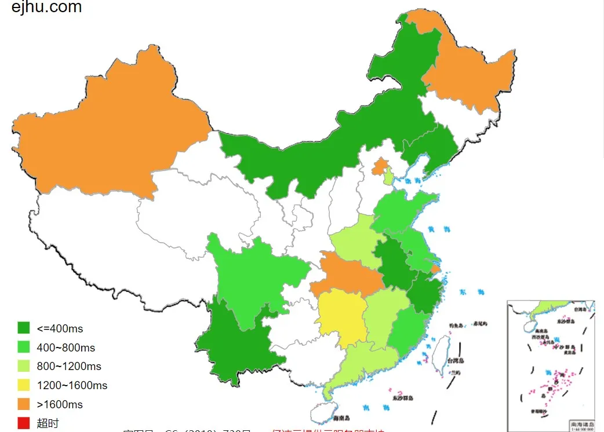

# 网页加载速度提升

&gt; **网站正在完善中...**

`&lt;del&gt;`现在本站为了**提高访问速度，启动了双站点**。国内访问部署在 **Coding**  上的站点，国外访问部署在 **Github** 上的站点。`&lt;/del&gt;`

通过前几天网站有时无法访问发现，Coding 有时候不稳定，所以放弃使用 Coding 加速访问。
**现在使用 Github&#43;Vercel 来部署网站**，现在加载速度不错。

如图：

---

> 作者:   
> URL: https://blog.wenyi.org/posts/webpage-speed-up/  

