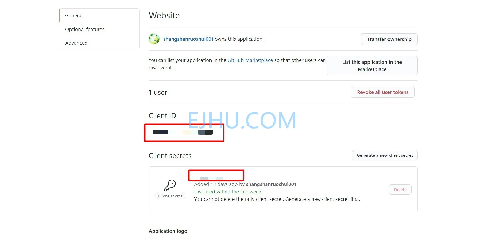
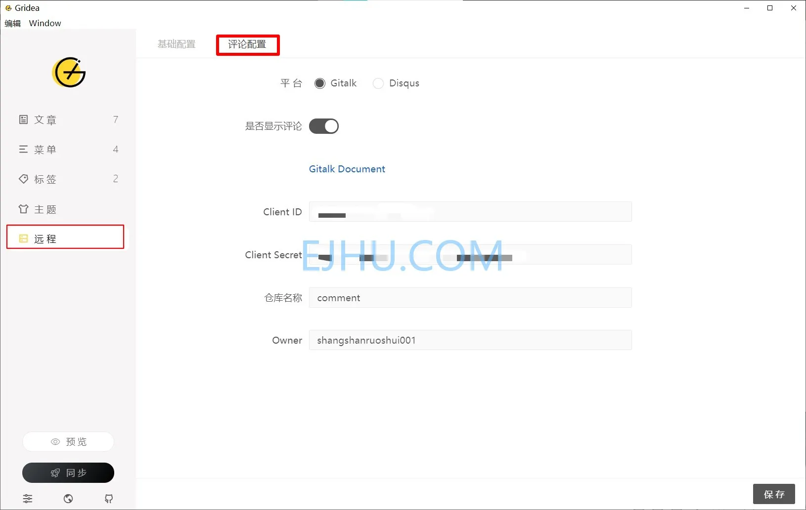

# 建站笔记 (4)

&gt; 这是建站笔记第四篇文章。
&gt; 谈一下评论功能。

网站搭建好后，可以添加评论系统与访客互动。我写文章用的是 Gridea，下面以**Gridea&#43;Gitalk** 为例搭建评论系统。

## 1. Github

### 1.1 注册 GitHub Application

    https://github.com/settings/applications/new

打开后页面如下：

* _Application name_：**必填**，应用名称；
* _Homepage URL_：**必填**，应用的网址，即使用 Gitalk 的网站的网址；
* _Application description_：**选填**，应用的说明；
* _Authorization callback URL_：**必填**，授权回调网址，网站访问的网址。

### 1.2 生成 Client ID 和 Client Secret

填完以后，点击 Register application 进入以下页面：

复制页面中的 **Client ID** 和 **Client Secret**。

## 2. Gridea

### 2.1 Gitalk 配置

复制完以后，打开 Gridea 的评论配置。

* _Client ID_：填之前复制的 **Client ID**；
* _Client Secret_：填之前复制的 **Client Secret**;
* _仓库名称_ ：填**存放评论的仓库名**；
* _Owner_: 填 **Github用户名**。

---

> 作者:   
> URL: https://blog.wenyi.org/posts/website-log-four/  

