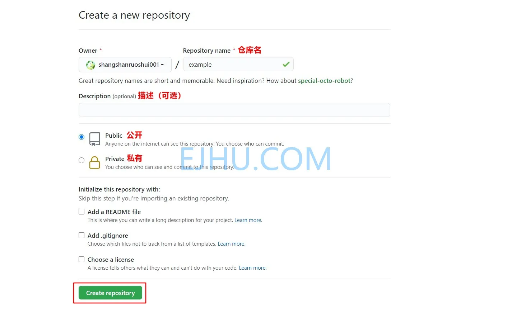
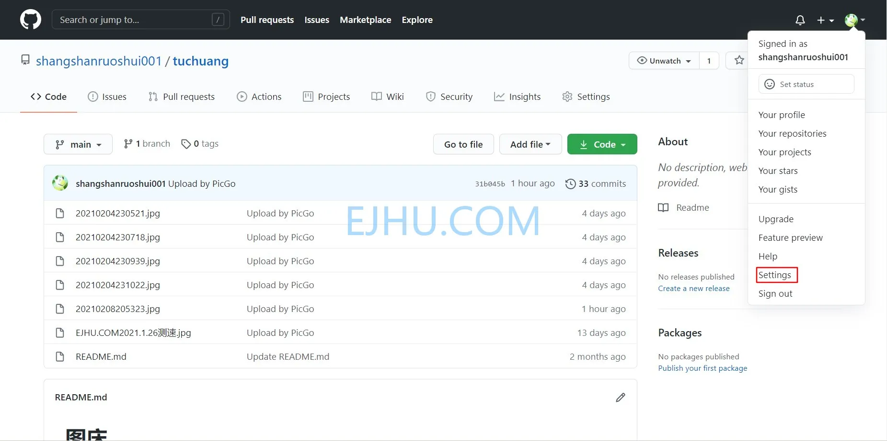
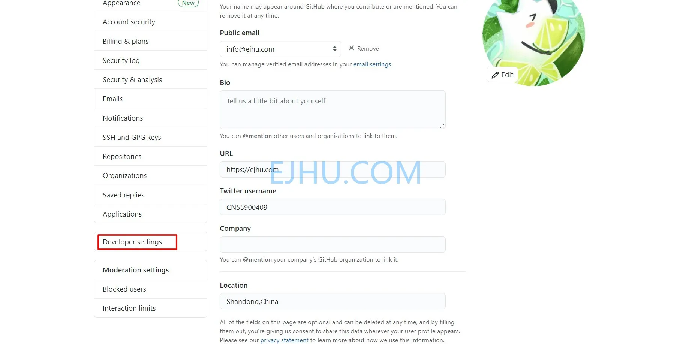
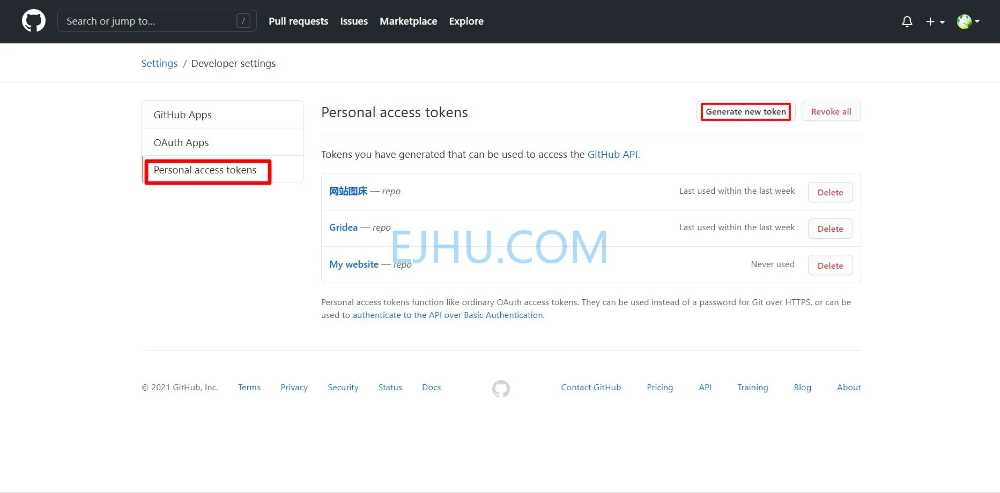
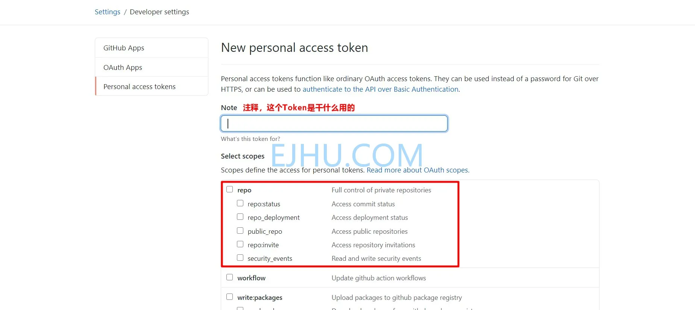
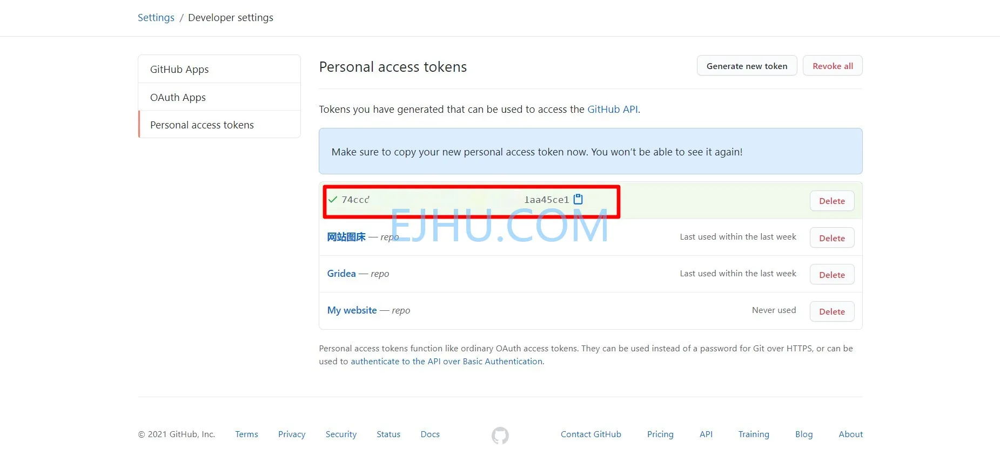
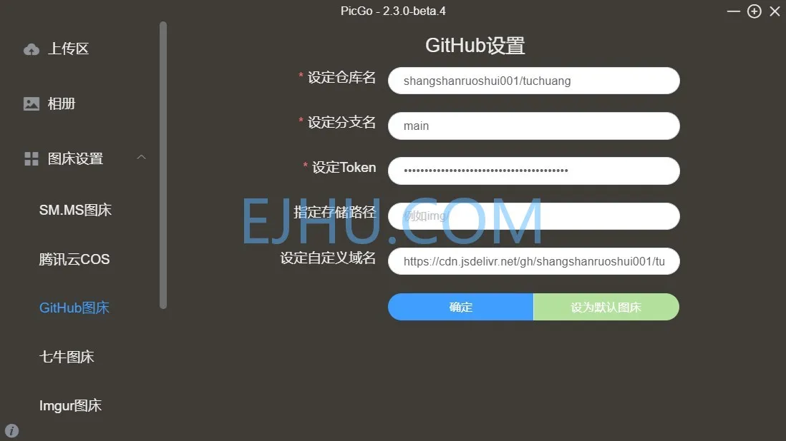

# 建站笔记 (3)

&gt; 这是建站笔记第三篇文章。
&gt; 谈一下图床。

图床是用来存放文章图片的，所以图床的访问速度是很重要的。第三方的免费图床不太稳定，万一哪天关停了服务，会很麻烦的。所以自己搭图床有保障，比较稳定。

搭建图床可以租用服务器，但是费用有点高，对于业余写文章的人而言没有必要。后来发现可以用 **Github&#43;PiceeGo** 搭建图床，配置简单而且稳定，缺点是别人可以访问图床。

# 1.Github

## 1.1 创建仓库

首先创建一个新仓库，仓库需要设置为 **Public**，不然通过 PicGo 上传的图片无法显示。

* _Repository name_ 这是仓库名；
* _Description_ 这是仓库的描述，可选填；
* _Add a README file_ 添加自述文件，选不选都可以。

## 1.2 创建 token

仓库建立后，点击右上角头像，然后点击 **Settings** 进入设置；

接下来向下翻，在页面的下方找到 **Developer settings** ，点击进入；

先点击 **Personal access tokens**，然后点击 **Generate new token**；

填写 **Note**，勾选复选框 **repo**;

接下来复制生成的 **token**，**注意：确保立即复制新的个人访问令牌，该 token 仅出现一次，关闭页面后无法再次看到它。**

# 2.PicGo

## 2.1 下载 PicGo

官网：_[https://molunerfinn.com/PicGo/](https://molunerfinn.com/PicGo/)_

## 2.2 设置

* _设定仓库名_ 填仓库名；
* _设定分支名_ 填 **main**;
* _设定 Token_ 填之前创建的 **Token**;
* _指定储存路径_ 不需要填；
* _设定自定义域名_ 默认的域名需要改一下，修改为加速域名。

**格式：**

    https://cdn.jsdelivr.net/gh/username/repositories/

---

> 作者:   
> URL: https://blog.wenyi.org/posts/website-log-three/  

