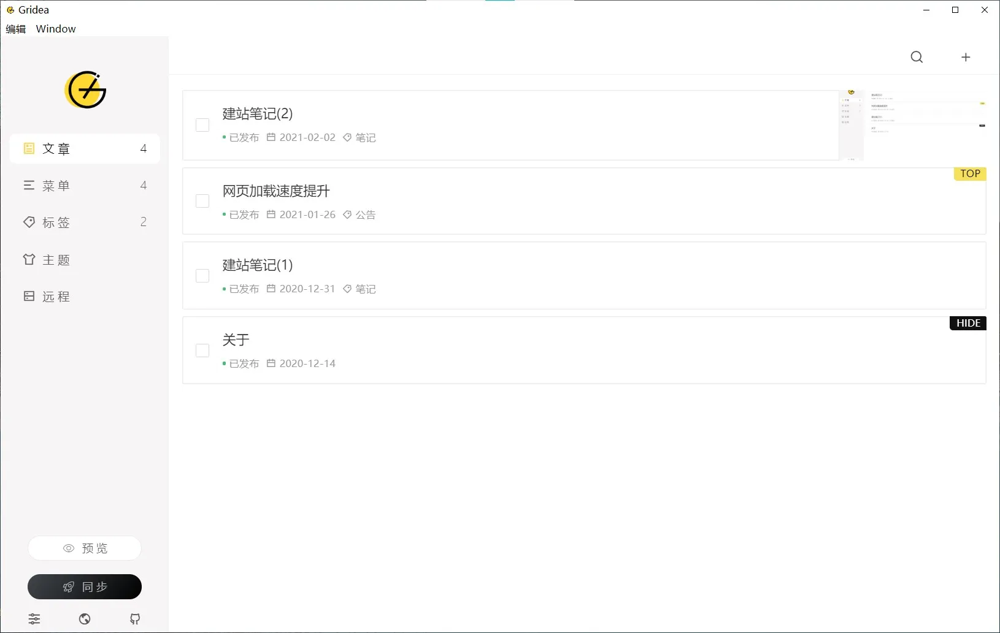
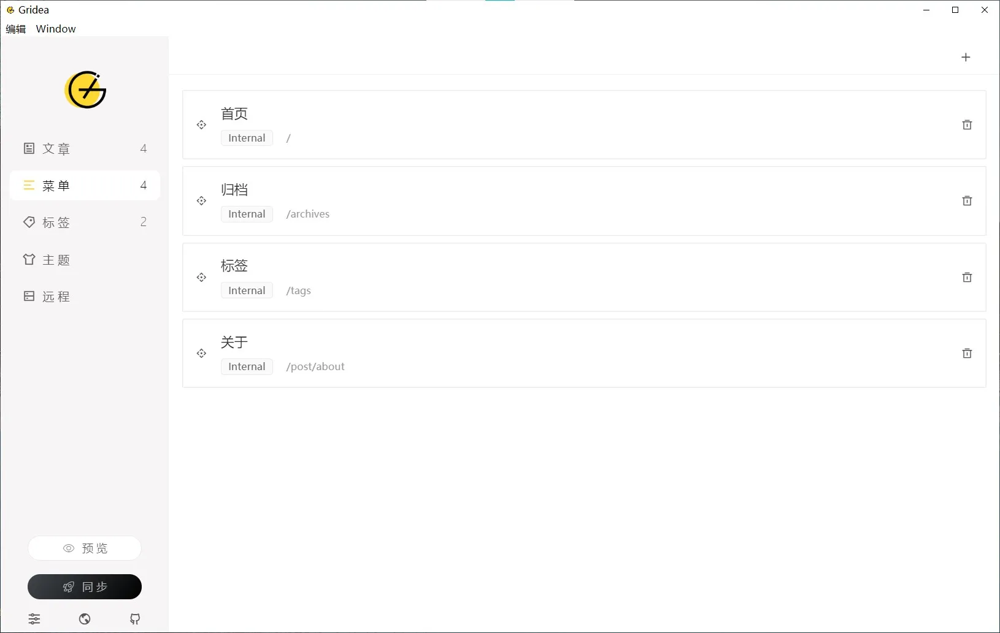
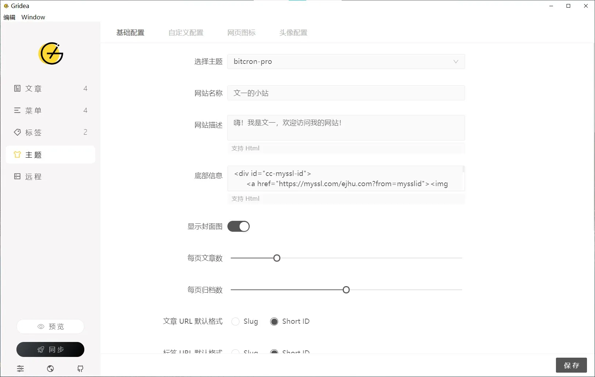
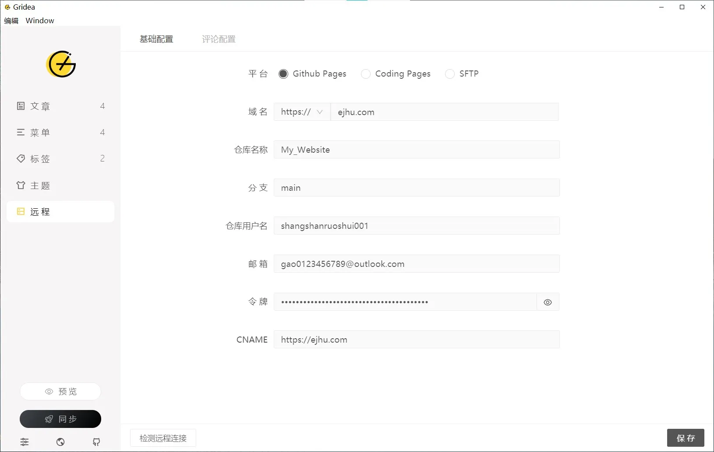

# 建站笔记 (2)

&gt; 这是建站笔记第二篇文章。
&gt; 谈一下写作工具。

## 概括

静态页面写作一般用的是 Markdown，Markdown 是一种轻量级标记语言。我现在用的是 **Gridea**，**Gridea 是一个静态博客写作客户端**，支持 Windows、Mac OS、Liunx。可以使用 Github Pages，Gitee Pages 和 Coding Pages 等服务来搭建自己的静态博客，然后就能使用它进行愉快的创作了。当然也可以把它当作一个纯粹的    markdown 写作工具，并且最新的版本也支持 Katex 公式。

## 文章

可以在**文章**选项查看和管理文章，非常方便。

## 菜单

**菜单**可以管理页面的菜单。

## 主题

**主题**管理网站的配置。在这里可以修改网站主题、名称、底部信息等。目前 Gridea 内置 4 款主题 ，分别是 Notes、Simple、Fly、Paper。除此之外可以在这里下载其他主题：[https://gridea.dev/themes](https://gridea.dev/themes)

## 远程

**远程**是 **Gridea** 与 **Github Pages** 连接配置，只有配置完成后才能上传网站。

* 域名：Github Pages 对应的域名（例如：[https://username.github.io](https://username.github.io) 或 [http://example.com](http://example.com)）
* 仓库名称：自己的静态文件存放的仓库（例如：[https://username.github.io](https://username.github.io)）
* 分支：你的 Github Pages 对应的分支（例如：main）
* 仓库用户名：仓库所属用户的用户名（通常就是自己的 Github 账号的昵称）
* 邮箱：Git 推送时使用的邮箱（通常就是自己的 Github 账号的邮箱）
* 令牌: Git 推送时需要的 Token，用来向 Github 提交构建后的文件 Github personal access tokens
* CNAME: 可通过这个选项配置自己的域名（例如：[http://example.com](http://example.com)）

**Gridea 官网：[https://gridea.dev](https://gridea.dev)**

先写到这里，抽空补充。

---

> 作者:   
> URL: https://blog.wenyi.org/posts/website-log-two/  

