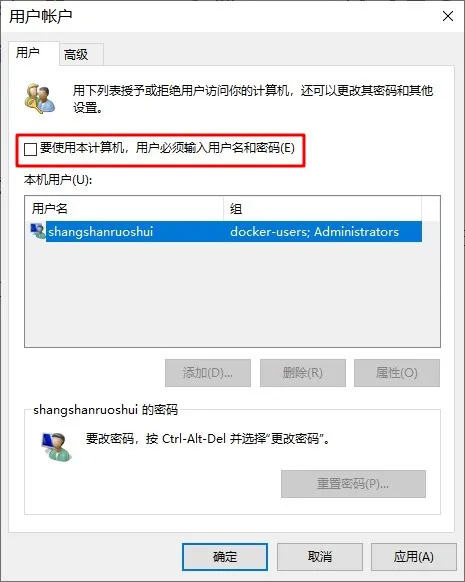
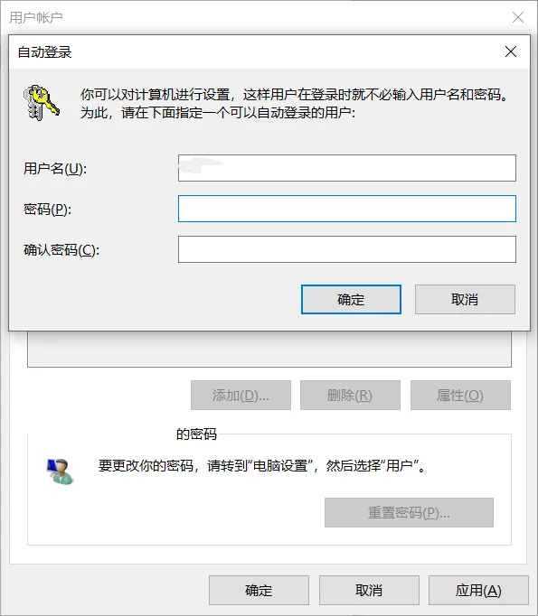

# Windows 10 开启自动登录

Windows 10 登录默认需要输入密码，有时候觉得麻烦，想要自动登录。

## 方法

### 使用高级用户账户控制面板

1.组合键 **Windows&#43;R** 打开运行，输入 `control userpasswords2` 或 `netplwiz` 执行；

2.在弹出的**用户帐户**窗口中取消勾选「要使用本计算机，用户必需输入用户名和密码」，然后应用；

输入用户名和密码确定后就可以使用自动登录了。

---

> 作者:   
> URL: https://blog.wenyi.org/posts/windows10-automatic-login/  

